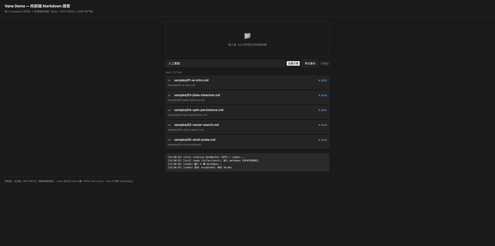

# Vane Demo — 纯前端 Markdown 搜索（M2-14）

纯前端页面：拖入 markdown 文件夹 → 本地混合检索（jieba 中文分词 + OPFS 持久化 + SIMD 双产物），无后端。展示 Vane 浏览器交付闭环（SPEC §15 M2 Demo）。



## 功能

- **拖入文件夹**：递归解析 `.md` 文件为 `{id, text, vector}` 文档。
- **中文搜索**：jieba 分词（词典 jsdelivr gh CDN fetch + sha256 校验 + OPFS 缓存）；断网降级 bigram 不报错。
- **混合搜索**：文本 + 向量 RRF 融合（vector 用占位 hash 向量，SPEC Won't-have：Vane 不内置 embedding）。
- **OPFS 持久化**：数据跨刷新保留（OPFS 不可用降级 IndexedDB）。
- **SIMD 双产物**：运行时 `WebAssembly.validate` 探测 simd128 → 加载 simd/scalar 产物。
- **导出备份**：`db.export("backup.vane")` 快照写入 OPFS。

## 前置条件

- Rust（wasm32-unknown-unknown target）+ [wasm-bindgen CLI](https://rustwasm.github.io/wasm-bindgen/reference/cli.html) + [wasm-opt](https://github.com/WebAssembly/wabt)（可选，优化）
- Node.js ≥ 18（e2e smoke 测试用）
- Python 3（本地静态服务器）

## 构建

```bash
# 在仓库根目录
bash demo/build.sh
```

产出 `demo/pkg/`：
- `vane_wasm.js` — wasm-bindgen JS 胶水
- `vane_wasm_simd.wasm` — SIMD128 产物（~312KB gzip）
- `vane_wasm_scalar.wasm` — scalar 产物（~314KB gzip）
- `dict.bin` + `sha256_prefix.bin` — jieba 词典（本地离线备用；DICT_URL 默认指向 jsdelivr gh CDN，见 main.js）

另产出 `demo/pkg-node/`（wasm-bindgen `--target nodejs`，供 e2e smoke 测试用）。

## 启动

```bash
cd demo
python3 -m http.server 8765
# 浏览器打开 http://localhost:8765/index.html
```

> 必须通过 http://localhost 访问——`file://` 下 Worker/OPFS/ES module 受限。

## 操作

1. 点击"加载示例"加载内置 5 篇中文 markdown，或拖入含 `.md` 文件的文件夹到拖入区。
2. 等待日志显示 `[index] 完成`。
3. 搜索框输入中文（如"人工智能"、"向量检索"）或英文（如"vector"）。
4. 点击"导出备份"将快照写入 OPFS（`backup.vane`）。
5. 刷新页面 → 数据保留（OPFS 持久化）。

## 验证

```bash
# node smoke（API 路径 + jieba + sha256 + 中文搜索）
node demo/e2e/run-smoke.mjs
```

浏览器 e2e 验证（csi 真实 Chrome）见 `MANUAL-CHECKLIST.md`。

## 结构

```
demo/
  index.html           # 拖入区 + 搜索框 + 结果列表 + 导出按钮
  main.js              # 主页面 JS（Worker 调用 + 拖入处理 + UI）
  worker.js            # Worker 入口（SIMD 探针 + 动态选 wasm + postMessage 路由）
  build.sh             # 构建 wasm 双产物 + JS 胶水 + dict.bin
  README.md            # 本文件
  MANUAL-CHECKLIST.md  # 验收清单（9 项）
  screenshot.png       # demo 截图
  e2e/
    run-smoke.mjs      # node smoke 测试
  samples/             # 示例 markdown（5 篇中文）
  pkg/                 # 构建产物（gitignore）
  pkg-node/            # nodejs 构建产物（gitignore，smoke 用）
```

## 占位向量说明

demo 用 `hashVector(text)` 生成的**确定性伪向量**（char unigram/bigram bucket → 64 维 L2 归一化），**不是真实语义 embedding**。同文本同向量、共享字符的文本 cosine 相似度更高，足以演示 vector 召回路与 hybrid 融合。

**生产应替换为真实 embedding API**（如 [transformers.js](https://huggingface.co/docs/transformers.js) / OpenAI / Cohere / 本地模型）。SPEC Won't-have：**Vane 不内置 embedding**——向量由调用方提供，Vane 只负责存储、索引、检索、融合。

## 技术细节

- **Worker 通信**：主页面 `postMessage({op, id, ...})` → Worker 调 `VaneWorker` 方法 → `postMessage({id, result|error})`（Promise 边界，I-8 薄壳）。
- **OPFS**：`navigator.storage.getDirectory` → `createSyncAccessHandle` → 同步读写；不可用降级 IndexedDB。
- **SIMD 探针**：`WebAssembly.validate(含 v128.const 的模块)` → 选 simd/scalar 产物。
- **词典三渠道**：`dictData` 内联 / `dictUrl` CDN fetch（jsdelivr gh：`https://cdn.jsdelivr.net/gh/ximing/vane@main/crates/vane-dict-zh/data/dict.bin`）+ sha256 校验 + OPFS 缓存（二次零网络）/ 降级 bigram + warn。
  - private 仓库期间 jsdelivr 返回 404 → CDN fetch 失败 → 降级 bigram（不抛错）；转 public 后自动生效。
  - 本地离线开发：`build.sh` 拷贝 `dict.bin` + `sha256_prefix.bin` 到 `demo/pkg/`，可将 `DICT_URL` 临时改回 `"./pkg/dict.bin"`（同源，sha256_prefix 一致）。
