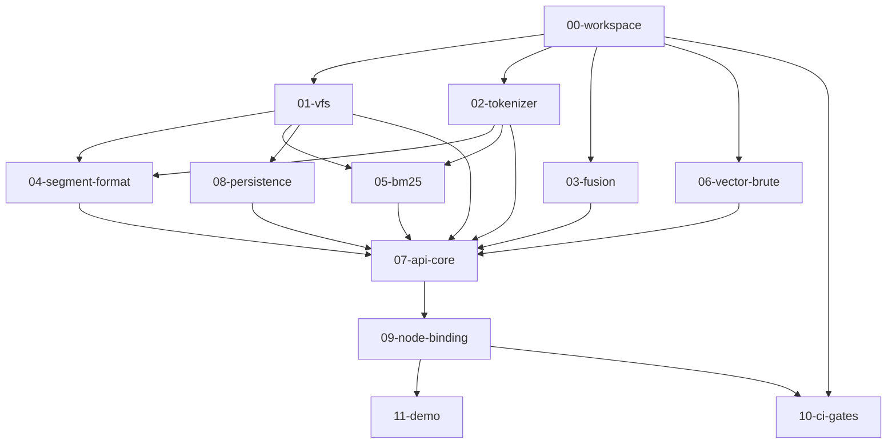

# Vane M0 实现计划索引

> 本文件是 M0 阶段编排者的调度依据，也是各计划之间类型签名的**单一事实源**。
> 任何跨计划的类型/函数名/签名分歧以本文件 `Global Interface Contracts` 节为准。
> SPEC 节号引用 `docs/SPEC.md` v1.0。

---

## 计划文件清单

| # | 文件 | 一句话摘要 | 产出模块 |
|---|---|---|---|
| 00 | `00-workspace.md` | Cargo workspace 脚手架 + 基础类型（VaneError/Schema/常量）+ git init | vane-core 骨架 |
| 01 | `01-vfs.md` | VFS trait + Memory/StdFs 后端 + LRU PageCache | vane_core::vfs |
| 02 | `02-tokenizer.md` | standard + cjk_bigram 分词器 + Tokenizer trait + TokenizerId 计算 | vane_core::tokenizer |
| 03 | `03-fusion.md` | RRF(k=60) + linear(minmax) 融合算法 | vane_core::fusion |
| 04 | `04-segment-format.md` | 段文件格式（header/vectors/stored/scalars）+ SegmentWriter/Reader + ULID | vane_core::segment |
| 05 | `05-bm25.md` | 倒排索引构建 + Block-Max WAND top-k + posting vbyte 编码 | vane_core::bm25 |
| 06 | `06-vector-brute.md` | 暴力向量扫描（cosine/l2/dot）+ topK 堆 | vane_core::vector |
| 07 | `07-api-core.md` | Db/Collection/SearchQuery/Hit + add/flush/search 编排 | vane_core::api |
| 08 | `08-persistence.md` | Manifest 原子切换 + AutoCommitter + open 加载 | vane_core::persistence |
| 09 | `09-node-binding.md` | napi-rs 绑定 + AsyncTask 异步 + 4 平台 prebuilt 配置 | vane-node |
| 10 | `10-ci-gates.md` | wasm32 check 门禁 + clippy/cargo-deny + benchmark CI + 4 平台构建 | .github/workflows |
| 11 | `11-demo.md` | 1 万维基摘要三列排序对比脚本 | examples/demo |

---

## 依赖图（拓扑序）



### 拓扑批次（可并行标注）

| 批次 | 计划 | 可并行 |
|---|---|---|
| L0 | 00-workspace | 单独 |
| L1 | 01-vfs, 02-tokenizer, 03-fusion, 06-vector-brute | **4 路并行** |
| L2 | 04-segment-format, 05-bm25, 08-persistence | **3 路并行** |
| L3 | 07-api-core | 单独（消费 L1+L2 全部） |
| L4 | 09-node-binding | 单独 |
| L5 | 11-demo | 单独 |
| 横跨 | 10-ci-gates | wasm32 门禁部分 L0 后即可；4 平台 prebuilt 部分依赖 09 |

**最大并行度**：L1 阶段 4 路并行，L2 阶段 3 路并行。编排者优先调度 L0→L1 四路并发。

---

## M0 范围边界（不得越界）

### M0 实现
- open / collection / collections / add / flush / search（无 filter）/ close
- 分词器：`standard` + `cjk_bigram`（`jieba` 仅 API 占位，返回 `E_DICT_UNAVAILABLE`）
- 暴力向量扫描（cosine / l2 / dot）
- BM25 倒排 + Block-Max WAND top-k
- RRF(k=60) + linear(minmax) 融合
- VFS trait + MemoryVfs + StdFsVfs + PageCache
- 段文件格式（header/vectors/inverted/stored/scalars）
- manifest 原子切换 + flush 语义 + auto-commit（计数 + 时间双触发）
- Node napi-rs 绑定 + 4 平台 prebuilt
- wasm32 check CI 门禁 + clippy + cargo-deny + benchmark CI
- demo：1 万维基摘要三列排序对比

### M0 仅 API 占位（签名冻结，返回 `E_UNSUPPORTED`）
- `delete` / `compact` / `reindex` / `export`

### M0 不实现（M1/M2）
- HNSW、tombstone 删除、段合并、pre-filter、薄 WAL、jieba 词典、Go cgo、浏览器交付、SQ8、SIMD 双变体

---

## Global Interface Contracts

> 以下签名是各计划之间**唯一的沟通渠道**。定义它的计划标 `Produced by`，消费它的计划标 `Consumes from`。
> 所有类型位于 `vane_core` crate，路径前缀 `vane_core::`。

### 00-workspace 产出（`vane_core::types`）

```rust
// 错误码（SPEC §10）
pub enum VaneError {
    Io(String), Schema(String), NotFound(String), Corrupt(String),
    Version(String), TokenizerMismatch(String), DictTooLarge, DictUnavailable,
    Busy, Unsupported, InvalidArg(String),
}
impl VaneError {
    pub fn code(&self) -> i32;  // §10 映射：Io=-1, Schema=-2, NotFound=-3, Corrupt=-4,
                                // Version=-5, TokenizerMismatch=-6, DictTooLarge=-7,
                                // DictUnavailable=-8, Busy=-9, Unsupported=-10, InvalidArg=-11
    pub fn name(&self) -> &'static str;
}
impl std::fmt::Display for VaneError;
impl std::error::Error for VaneError;
pub type Result<T> = std::result::Result<T, VaneError>;

// 检索结果文档（跨 bm25/vector-brute/fusion）
pub struct ScoredDoc { pub docid: u64, pub score: f32 }

// 向量距离度量
pub enum Metric { Cosine, L2, Dot }

// 分词器身份标识（SPEC §5.4；sha256 产物，[u8;32]）
// 结构定义在 workspace，计算逻辑在 02-tokenizer
pub struct TokenizerId(pub [u8; 32]);
impl TokenizerId {
    pub fn as_bytes(&self) -> &[u8; 32];
    pub fn to_hex(&self) -> String;
    pub fn from_hex(s: &str) -> Result<Self>;
}

// Schema（SPEC §3.1）
pub enum ScalarKind { Int, Float, Bool, Keyword }
pub enum FieldDef {
    Text,
    Vector { dim: u32, metric: Metric },
    Scalar { kind: ScalarKind },
}
pub struct Schema { pub fields: Vec<(String, FieldDef)> }
impl Schema {
    pub fn new(fields: Vec<(String, FieldDef)>) -> Result<Self>;
    pub fn vector_field(&self) -> Result<(&str, u32, Metric)>;  // (name, dim, metric)；恰好一个
    pub fn text_fields(&self) -> Vec<&str>;
    pub fn validate(&self) -> Result<()>;  // dim≤4096；恰好一个 vector 字段
}

// 冻结常量（SPEC §3.3/§4.2/§6.3/§8.2/§6.1）
pub const DIM_MAX: u32 = 4096;
pub const TOPK_MAX: u32 = 1000;
pub const SEGMENT_MAX: usize = 10;
pub const DOC_MAX_BYTES: usize = 16 * 1024 * 1024;
pub const BM25_K1: f32 = 1.2;
pub const BM25_B: f32 = 0.75;
pub const RRF_K: u32 = 60;
pub const PAGE_CACHE_DEFAULT_MB: u32 = 32;
pub const PAGE_SIZE: usize = 64 * 1024;
pub const MAGIC: &[u8; 4] = b"VANE";
pub const FORMAT_VERSION: u32 = 1;
pub const MAX_SEGMENT_DOCS_SMALL: u32 = 10_000;  // 小段阈值（§3.3）
```

依赖：`roaring` crate（tombstone/filter 位图，M0 起加入 workspace）。

**lib.rs 预声明（B1 裁决）**：00-workspace 一次性预声明全部 9 个模块——
`pub mod types; pub mod vfs; pub mod tokenizer; pub mod fusion; pub mod vector; pub mod segment; pub mod bm25; pub mod persistence; pub mod api;`
每个模块建空占位文件（内容仅 `// 由 NN-xxx 计划填充`）。后续 L1/L2 各计划**不再改 lib.rs**，只填充各自模块文件。

**Cargo.toml 一次性依赖（B1 裁决）**：00-workspace 的 vane-core Cargo.toml 一次性加入全部后续模块所需依赖——
`roaring`、`sha2`、`serde`(derive)、`serde_json`、`unicode-segmentation`、`rust-stemmers`、`ulid`。
**不引入 dashmap、不引入 parking_lot**（B2 裁决：并发原语统一 `std::sync::RwLock`/`Mutex`，wasm32 绝对安全）。

### 01-vfs 产出（`vane_core::vfs`）

```rust
// SPEC §6.1 VFS trait（M0 冻结签名）
pub trait Vfs: Send + Sync {
    fn create(&self, path: &str) -> Result<()>;
    fn read_at(&self, path: &str, buf: &mut [u8], offset: u64) -> Result<usize>;
    fn write_at(&self, path: &str, buf: &[u8], offset: u64) -> Result<()>;
    fn append(&self, path: &str, buf: &[u8]) -> Result<u64>;   // 返回写入起始 offset
    fn sync(&self, path: &str) -> Result<()>;
    fn rename(&self, from: &str, to: &str) -> Result<()>;
    fn delete(&self, path: &str) -> Result<()>;
    fn list(&self, dir: &str) -> Result<Vec<String>>;
}

pub struct MemoryVfs { /* std::sync::RwLock<HashMap<String, Vec<u8>>> */ }
impl MemoryVfs {
    pub fn new() -> Self;
}
impl Vfs for MemoryVfs { ... }

pub struct StdFsVfs { /* root: PathBuf */ }
impl StdFsVfs {
    pub fn new() -> Self;  // 相对当前目录；root 为 ""
}
impl Vfs for StdFsVfs { ... }

// LRU 页缓存（SPEC §6.1；默认 32MB，页 64KB）
pub struct PageCache { /* capacity, page_size, LRU map */ }
impl PageCache {
    pub fn new(capacity_bytes: usize, page_size: usize) -> Self;
    pub fn read(&mut self, vfs: &dyn Vfs, path: &str, offset: u64, len: usize) -> Result<Vec<u8>>;
    pub fn invalidate(&mut self, path: &str);
}
```

### 02-tokenizer 产出（`vane_core::tokenizer`）

```rust
pub struct Token { pub text: String, pub position: u32 }

pub trait Tokenizer: Send + Sync {
    fn tokenize(&self, text: &str) -> Vec<Token>;
    fn id(&self) -> &TokenizerId;
}

pub enum BuiltinTokenizer { Standard, CjkBigram, Jieba }

pub enum UserDictEntry {
    Word(String),
    WordWithFreq { term: String, freq: u32 },
}

// 工厂：M0 Standard/CjkBigram 完整实现；Jieba 返回 Err(DictUnavailable)
pub fn build_tokenizer(
    kind: BuiltinTokenizer,
    user_dict: &[UserDictEntry],
) -> Result<Box<dyn Tokenizer>>;

// 计算 TokenizerId（SPEC §5.4）
// sha256( algorithm_version || builtin_dict_version || user_dict_bytes )
pub fn compute_tokenizer_id(
    kind: BuiltinTokenizer,
    user_dict: &[UserDictEntry],
) -> TokenizerId;
```

### 03-fusion 产出（`vane_core::fusion`）

```rust
// 单路候选（rank 从 0 开始，按 score 降序）
pub struct FusionCandidate { pub docid: u64, pub rank: u32, pub score: f32 }

// RRF（SPEC §8.2；k=60 冻结）
// score(d) = Σ_path 1/(k + rank_path(d))
pub fn rrf_fuse(paths: &[Vec<FusionCandidate>], k: u32) -> Vec<ScoredDoc>;

// linear 归一化输入
pub struct LinearInput { pub docid: u64, pub score: f32 }

// minmax 归一化（按当次候选集；SPEC §8.2）
pub fn minmax_normalize(scored: &[ScoredDoc]) -> Vec<LinearInput>;

// linear 融合：alpha × vec + (1-alpha) × text
pub fn linear_fuse(
    vec_scores: &[LinearInput],
    text_scores: &[LinearInput],
    alpha: f32,
) -> Vec<ScoredDoc>;
```

### 04-segment-format 产出（`vane_core::segment`）

```rust
use vane_core::types::{Schema, TokenizerId, Metric, Result};
use vane_core::vfs::Vfs;

pub fn gen_ulid() -> String;  // 26 字符 ULID

pub struct SegmentMeta {
    pub ulid: String,
    pub doc_count: u32,
    pub docid_base: u64,
    pub tokenizer_id: TokenizerId,
    pub tombstones: roaring::RoaringBitmap,  // M0 为空（delete 是 M1）
}

// 写期：构建 header.bin / vectors.bin / stored.bin / scalars.col
// 不写 inverted.bin（由 05-bm25 的 write_inverted 单独写）
pub struct SegmentWriter { /* ... */ }
impl SegmentWriter {
    pub fn new(
        vfs: std::sync::Arc<dyn Vfs>,
        segments_dir: &str,
        schema: &Schema,
        tokenizer_id: &TokenizerId,
        docid_base: u64,
    ) -> Result<Self>;
    // 返回段内 docid（从 docid_base 起 u64 单调递增）
    pub fn add_doc(
        &mut self,
        external_id: &str,
        vector: Option<&[f32]>,
        stored_json: &str,
    ) -> Result<u64>;
    pub fn finalize(self) -> Result<SegmentMeta>;  // sync 所有文件
    pub fn docid_base(&self) -> u64;
}

// 读期：加载 header/vectors/stored，提供查询访问
pub struct SegmentReader { /* ... */ }
impl SegmentReader {
    pub fn open(
        vfs: &std::sync::Arc<dyn Vfs>,
        segment_dir: &str,
    ) -> Result<Self>;
    pub fn meta(&self) -> &SegmentMeta;
    pub fn vectors(&self) -> &[f32];           // vectors.bin 全加载（M0 暴力扫描需要）
    pub fn dim(&self) -> u32;
    pub fn doc_count(&self) -> u32;
    pub fn external_id(&self, docid: u64) -> Option<&str>;
    pub fn stored_json(&self, local_docid: u64) -> Option<&str>;  // 读 stored.bin 回填 Hit.fields
    pub fn segment_dir(&self) -> &str;          // 供 bm25 读 inverted.bin
    pub fn vfs(&self) -> &std::sync::Arc<dyn Vfs>;
}
```

段目录布局（SPEC §6.2）：`<db>/segments/seg_<ulid>/{header.bin, vectors.bin, inverted.bin, scalars.col, stored.bin}`。

### 05-bm25 产出（`vane_core::bm25`）

```rust
use vane_core::tokenizer::Token;
use vane_core::types::{ScoredDoc, Result, BM25_K1, BM25_B};
use vane_core::vfs::Vfs;

// 写期：构建内存倒排
pub struct InvertedIndexBuilder { /* ... */ }
impl InvertedIndexBuilder {
    pub fn new(doc_count_hint: usize) -> Self;
    pub fn add_document(&mut self, docid: u64, tokens: &[Token], field_length: u32);
    pub fn build(self) -> InvertedData;
}

pub struct InvertedData { /* 内存倒排：term -> [(docid_delta, tf)]，按 field 分区 */ }

// 写 inverted.bin 到段目录（SPEC §6.3 posting 布局）
// 格式：magic|version|num_terms|{term_len|term_bytes|doc_freq|block_data}...
// block_data：每 128 doc 一跳块，vbyte(docid_delta, tf)，块头 max_score
pub fn write_inverted(
    vfs: &dyn Vfs,
    segment_dir: &str,
    data: &InvertedData,
) -> Result<()>;

// 读期：从段加载倒排并查询
pub struct InvertedIndexReader { /* ... */ }
impl InvertedIndexReader {
    pub fn open(vfs: &std::sync::Arc<dyn Vfs>, segment_dir: &str) -> Result<Self>;
    // Block-Max WAND top-k（SPEC §8.1 text 模式）
    pub fn search(
        &self,
        query_tokens: &[Token],
        topk: usize,
        filter: Option<&roaring::RoaringBitmap>,
    ) -> Vec<ScoredDoc>;
    pub fn doc_count(&self) -> u64;
    pub fn avg_field_length(&self) -> f32;
}
```

BM25 公式（SPEC §6.3 冻结）：`score = IDF * (tf * (k1+1)) / (tf + k1*(1 - b + b*dl/avgdl))`，`k1=1.2, b=0.75`。

### 06-vector-brute 产出（`vane_core::vector`）

```rust
use vane_core::types::{ScoredDoc, Metric};

// 暴力扫描（SPEC §8.1 vector 模式；M0 无 HNSW）
// vectors: 扁平 f32 数组，doc i 的向量 = vectors[i*dim .. (i+1)*dim]
// filter: 允许的 docid 集合（M0 传 None；M1 pre-filter 用）
// docid_base: 段内起始 docid，结果 docid = docid_base + local_index
pub fn brute_search(
    vectors: &[f32],
    dim: u32,
    query: &[f32],
    metric: Metric,
    topk: usize,
    filter: Option<&roaring::RoaringBitmap>,
    docid_base: u64,
) -> Vec<ScoredDoc>;
```

### 07-api-core 产出（`vane_core::api`）

> `api/mod.rs` 必须 re-export 公共类型：`pub use types::*; pub use db::*; pub use collection::*;`，
> 使得 `vane_core::api::{Db, OpenOptions, Collection, SearchQuery, Hit, ...}` 路径可直接导入（09-node-binding 依赖此路径）。

```rust
use vane_core::types::{Schema, Metric, Result, VaneError};
use vane_core::tokenizer::{BuiltinTokenizer, UserDictEntry};
use vane_core::persistence::{AutoCommitConfig, Persistence};

pub enum PersistenceMode { Persistent, BestEffort }

pub struct OpenOptions {
    pub persistence: PersistenceMode,
    pub auto_commit: AutoCommitConfig,  // 来自 08-persistence
    pub page_cache_mb: u32,             // 默认 32
}
impl Default for OpenOptions;

pub struct CollectionOptions {
    pub tokenizer: BuiltinTokenizer,    // 默认 Standard
    pub user_dict: Vec<UserDictEntry>,
    pub auto_commit: AutoCommitConfig,  // I3: collection 级 auto-commit 配置
}
impl Default for CollectionOptions;

pub enum SearchMode { Hybrid, Vector, Text, Auto }  // Auto 为内部推断标记，JS/Go 绑定层不暴露 'auto' 字符串（S8）
pub enum FusionSpec { Rrf, Linear { alpha: f32 } }
pub enum ScalarValue { Int(i64), Float(f64), Bool(bool), Keyword(String) }
pub enum FilterCond { Eq(ScalarValue), In(Vec<ScalarValue>), Gte(ScalarValue), Lte(ScalarValue) }
pub struct Filter { pub fields: Vec<(String, FilterCond)> }  // M0 不实现，传非空返回 InvalidArg

pub struct SearchQuery {
    pub text: Option<String>,
    pub vector: Option<Vec<f32>>,
    pub top_k: u32,                 // 默认 10，上限 1000
    pub mode: SearchMode,
    pub fusion: FusionSpec,         // 默认 Rrf
    pub filter: Option<Filter>,     // M0 不实现
    pub candidate_multiplier: u32,  // 默认 3
}
impl Default for SearchQuery;

pub struct Hit { pub id: String, pub score: f32, pub fields: Option<std::collections::HashMap<String, String>> }
pub struct AddReport { pub accepted: u64, pub visible_after_flush: bool }

pub struct Doc {
    pub id: String,
    pub text: Option<String>,
    pub vector: Option<Vec<f32>>,
    pub meta: Option<std::collections::HashMap<String, ScalarValue>>,
}

pub struct Db { /* 持有 vfs、manifest、collections 注册表 */ }
impl Db {
    pub fn open(vfs: std::sync::Arc<dyn Vfs>, path: &str, opts: OpenOptions) -> Result<Self>;
    pub fn collection(&self, name: &str, schema: Schema, opts: CollectionOptions) -> Result<Collection>;
    pub fn collections(&self) -> Vec<String>;
    pub fn export(&self, _dest: &str) -> Result<()> { Err(VaneError::Unsupported) }            // M0 占位
    pub fn close(&self) -> Result<()>;
}

pub struct Collection { /* 持有内存 buffer 段、tokenizer、segment readers 快照 */ }
impl Collection {
    pub fn add(&self, docs: &[Doc]) -> Result<AddReport>;
    pub fn flush(&self) -> Result<()>;
    pub fn search(&self, query: &SearchQuery) -> Result<Vec<Hit>>;
    pub fn delete(&self, _ids: &[String]) -> Result<u64> { Err(VaneError::Unsupported) }       // M0 占位
    pub fn compact(&self) -> Result<()> { Err(VaneError::Unsupported) }                        // M0 占位
    pub fn reindex(&self) -> Result<()> { Err(VaneError::Unsupported) }                        // M0 占位（ReindexHandle 留 M1）
}
```

### 08-persistence 产出（`vane_core::persistence`）

```rust
use vane_core::types::{Schema, Result, TokenizerId};
use vane_core::tokenizer::{BuiltinTokenizer, UserDictEntry};
use vane_core::vfs::Vfs;

pub struct CollectionMeta {
    pub schema: Schema,
    pub tokenizer_kind: BuiltinTokenizer,
    pub tokenizer_id: TokenizerId,
    pub user_dict: Vec<UserDictEntry>,
    pub segment_ulids: Vec<String>,
}

pub struct Manifest {
    pub version: u32,
    pub collections: std::collections::HashMap<String, CollectionMeta>,
}
impl Manifest {
    pub fn empty() -> Self;
}

// manifest.json 原子读写（SPEC §6.4）
pub struct ManifestStore { /* vfs, db_path */ }
impl ManifestStore {
    pub fn new(vfs: std::sync::Arc<dyn Vfs>, db_path: &str) -> Self;
    pub fn load(&self) -> Result<Option<Manifest>>;
    // 临时文件 → sync → rename 原子切换（SPEC §6.4；不变量 I-6）
    pub fn save_atomic(&self, manifest: &Manifest) -> Result<()>;
    pub fn add_segment(&self, collection: &str, ulid: &str) -> Result<()>;
}

pub enum AutoCommitConfig { Off, On { interval_ms: u32, max_docs: u32 } }
impl Default for AutoCommitConfig {  // 默认 On { 1000, 1000 }
    fn default() -> Self;
}

pub struct AutoCommitter { /* config, docs_since_flush, last_flush_ms */ }
impl AutoCommitter {
    pub fn new(config: AutoCommitConfig) -> Self;
    pub fn record_docs(&mut self, n: u32);
    pub fn should_flush(&self) -> bool;  // 计数 ≥ max_docs 或 距上次 ≥ interval_ms
    pub fn reset(&mut self);
}
```

### 09-node-binding 产出（`crates/vane-node`）

```rust
// napi-rs；不经过 C ABI（SPEC §9.3）
// 异步经 AsyncTask 提交 core 内部，不桥接 tokio
#[napi] pub struct VaneDb { inner: vane_core::api::Db }
#[napi] pub struct VaneCollection { inner: vane_core::api::Collection }

#[napi]
impl VaneDb {
    #[napi] pub async fn open(path: String, opts: serde_json::Value) -> napi::Result<VaneDb>;
    #[napi] pub async fn collection(&self, name: String, schema: serde_json::Value, opts: serde_json::Value) -> napi::Result<VaneCollection>;
    #[napi] pub fn collections(&self) -> napi::Result<Vec<String>>;
    #[napi] pub async fn close(&self) -> napi::Result<()>;
}

#[napi]
impl VaneCollection {
    #[napi] pub async fn add(&self, docs: serde_json::Value) -> napi::Result<serde_json::Value>;
    #[napi] pub async fn flush(&self) -> napi::Result<()>;
    #[napi] pub async fn search(&self, query: serde_json::Value) -> napi::Result<serde_json::Value>;
    #[napi] pub async fn delete(&self, ids: Vec<String>) -> napi::Result<u64>;  // M0 reject E_UNSUPPORTED
    #[napi] pub async fn reindex(&self) -> napi::Result<()>;                     // M0 reject E_UNSUPPORTED
}

// Db 侧
#[napi]
impl VaneDb {
    // ... open/collection/collections/close ...
    #[napi] pub async fn export(&self, dest: String) -> napi::Result<()>;        // M0 reject E_UNSUPPORTED
}

// Schema JSON 形状（B6 裁决：统一为数组形式，与 core Schema{fields: Vec<(String, FieldDef)>} 同构）：
// { "fields": [ {"name": "content", "type": "text"},
//               {"name": "embedding", "type": "vector", "dim": 384, "metric": "cosine"} ] }
```

### 10-ci-gates 产出（`.github/workflows/`）

- `ci.yml`：wasm32 check 门禁 + clippy + fmt + cargo-deny + test
- `benchmark.yml`：criterion benchmark，回退 >10% 报警
- `release.yml`：4 平台 Node prebuilt 构建 + 发布

### 11-demo 产出（`examples/demo/`）

- `load-wiki.js`：加载 1 万维基摘要 + 384 维向量
- `compare.js`：hybrid / vector-only / text-only 三列排序对比输出
- `package.json`：依赖 `@vane/node`（本地 link）

---

## 全局约束（SPEC §13.3 工程纪律门禁，每份计划必须遵守）

| 约束 | 值 | 来源 |
|---|---|---|
| core 禁 `std::fs`/`std::net`/mmap | CI 门禁，M0 第一天 | §6.1/§13.3 |
| `cfg` 只允许在 VFS/Executor 实现 | 核心算法零 cfg | §11/不变量 I-5 |
| 依赖黑名单 | regex / tokio / prost / tonic / openssl / lindera / ndarray / wee_alloc | §4.1/§13.3 |
| BM25 k1 / b | 1.2 / 0.75（冻结） | §6.3 |
| RRF k | 60（冻结） | §8.2 |
| 段数上限 | 10 | §3.3 |
| dim 上限 | 4096 | §3.1 |
| 单文档上限 | 16MB | §3.2 |
| topK 上限 | 1000 | §4.2 |
| 用户词表上限 | 10 万词条 | §5.3 |
| 页缓存默认 | 32MB，页 64KB | §6.1 |
| 段文件头 | 4 字节 magic + 4 字节 format_version | §6.2 |
| manifest 原子切换 | 临时文件 → sync → rename | §6.4/不变量 I-6 |
| wasm32 check | `cargo check --target wasm32-unknown-unknown -p vane-core` M0 起门禁 | §13.3 |
| 并发原语 | core 统一 `std::sync::RwLock`/`Mutex`；**不引入 dashmap/parking_lot** | §13.3 wasm32 安全 |

## 不变量覆盖矩阵

| 不变量 | 负责计划 | 测试要求 |
|---|---|---|
| I-1 段不可变 | 04-segment-format | segment 写后只读，更新=新段+manifest |
| I-2 双索引原子可见 | 07-api-core, 08-persistence | flush 后向量+倒排同快照出现 |
| I-3 图不原地删 | M1（M0 不实现 HNSW） | — |
| I-4 单一分词身份 | 02-tokenizer, 07-api-core | TokenizerId 写入段头+collection 元数据 |
| I-5 核心零平台分支 | 00-workspace, 10-ci-gates | core 无 cfg(target)；wasm32 check 门禁 |
| I-6 manifest 原子性 | 08-persistence | 崩溃后 manifest 指向完整状态；残留 tmp 安全清理 |
| I-7 FFI 内存铁律 | 09-node-binding（M0 napi 无裸指针） | M1 vane-ffi 详细测试 |
| I-8 binding 薄壳 | 09-node-binding | 绑定无检索逻辑，行为测试在 core |

---

## Self-Review 发现与待裁决疑点

### 已修复的不一致
1. **00-workspace 缺 serde 依赖**：08-persistence/04-segment-format 需要 Schema/FieldDef/Metric/TokenizerId/ScalarKind 派生 `Serialize/Deserialize`。已在 00-workspace 的 Cargo.toml 补 `serde`/`serde_json` 依赖，并在类型定义补 `#[derive(serde::Serialize, serde::Deserialize)]`（TokenizerId 用 `#[serde(transparent)]`）。
2. **02-tokenizer 缺 serde derive**：`BuiltinTokenizer`/`UserDictEntry` 需被 08-persistence 的 `CollectionMeta` 序列化。已在 02-tokenizer 补 derive。
3. **10-ci-gates wasm32 命令与 00-workspace feature 不一致**：10-ci-gates 原假设 core 有 `std/wasm` feature 隔离（`--no-default-features --features wasm`），但 00-workspace 未定义 feature。已统一为 SPEC §13.3 字面命令 `cargo check --target wasm32-unknown-unknown -p vane-core`（01-vfs 用 `cfg(not(target_arch="wasm32"))` 隔离 std_fs，core 默认可编译到 wasm32）。SPEC §12.1 的 feature 划分留待 M1。

### 已裁决疑点（原待裁决，现已全部落实）

1. **linear fusion M0 已启用**（疑点①裁决）：SPEC §4.2 M0 冻结 IDL 含 linear 选项；§8.2 linear 为显式选项非占位；03-fusion 已实现 `linear_fuse`+`minmax_normalize`。07-api-core Task 5 的 `FusionSpec::Linear { alpha }` 分支改为调用 `minmax_normalize` + `linear_fuse`，不再返回 `InvalidArg`。
2. **`InvertedIndexReader::open` 签名已统一为引用形式**（疑点②裁决）：统一为 `open(vfs: &std::sync::Arc<dyn Vfs>, segment_dir: &str) -> Result<Self>`，内部 `vfs: vfs.clone()` 存入结构体（与 SegmentReader::open 一致）。07-api-core 调用处 `InvertedIndexReader::open(reader.vfs(), reader.segment_dir())` 正好匹配。
3. **并发原语统一 std::sync**（疑点③裁决）：core 不依赖 dashmap/parking_lot。MemoryVfs 用 `std::sync::RwLock<HashMap<String, Vec<u8>>>`，DbInner/CollectionInner 用 `std::sync::RwLock`。零额外依赖、wasm32 绝对安全（SPEC §13.3 wasm32 check 从 M0 第一天为硬门禁）。
4. **09-node-binding 要求 Db/Collection 是 `Clone + Send + Sync`**：07-api-core 已用 `Arc<DbInner>`/`Arc<CollectionInner>` 实现 Clone；Send+Sync 由 Arc + Vfs: Send+Sync 自动保证。07 中不再写 `unsafe impl Send/Sync`（字段全自动，unsafe impl 掩盖未来风险）。

### M0 偏离记录（待 M1 补齐）

- **stored.bin 未做 zstd 压缩**（I10 裁决）：SPEC §6.2 标注 stored.bin 为"zstd 块压缩"，M0 写裸 JSON（避免引入 zstd 依赖 + wasm32 风险）。`format_version` 不变。M1 补 zstd 块压缩。
- **M0 暴力口径 recall 门禁**（I8 裁决）：SPEC §13.2-1 要求 hybrid recall@10 ≥ 0.95。M0 因 hybrid=暴力双路+RRF 基线，recall 恒为 1.0，测试断言 recall≥0.95 trivially 通过。10-ci-gates 的 ci.yml 增 `recall` job 跑 `cargo test --test recall`。M1 HNSW 落地后补真实回归 job。
