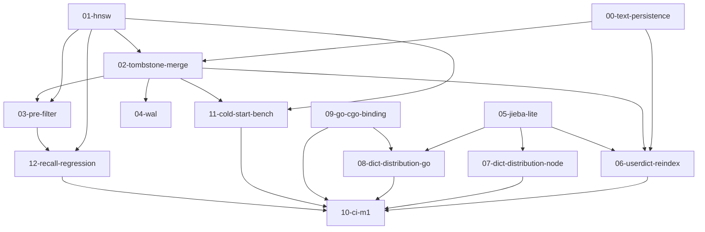

# Vane M1 实现计划索引

> 本文件是 M1 阶段编排者的调度依据，也是各计划之间类型签名的**单一事实源**。
> 任何跨计划的类型/函数名/签名分歧以本文件 `M1 Global Interface Contracts` 节为准。
> M0 既有契约见 `docs/plans/m0/README.md`（不重复；M1 计划消费 M0 pub API 须引用其精确签名）。
> SPEC 节号引用 `docs/SPEC.md` v1.1；需求引用 `docs/REQUIREMENTS.md` v1.1。

---

## 计划文件清单

| # | 文件 | 一句话摘要 | 产出模块 |
|---|---|---|---|
| 00 | `modules/00-text-persistence.md` | stored.bin 补全原文持久化（SPEC §6.2）+ SegmentReader::text | `vane_core::segment` 扩展 |
| 01 | `modules/01-hnsw.md` | 段内不可变 HNSW 图 + 多段串行搜索归并 + 暴力自适应回退 | `vane_core::hnsw` |
| 02 | `modules/02-tombstone-merge.md` | delete tombstone + 段合并 + compact() 实装 | `vane_core::merge` + api 扩展 |
| 03 | `modules/03-pre-filter.md` | metadata 过滤位图进 HNSW+WAND + 低选择率暴力回退 + scalars.col 写读 | `vane_core::filter` + segment 扩展 |
| 04 | `modules/04-wal.md` | 薄 WAL 元操作日志 + 崩溃恢复 | `vane_core::wal` |
| 05 | `modules/05-jieba-lite.md` | jieba 算法内核（DAG+HMM）+ 精简词典 DAT+zstd + 中英混排 | `vane_core::tokenizer::jieba`（feature `jieba`） |
| 06 | `modules/06-userdict-reindex.md` | setUserDict + reindex 状态机（§7.4）+ ReindexHandle | api 扩展 |
| 07 | `modules/07-dict-distribution-node.md` | `@vane/dict-zh` 数据包 + 主包 dependency + 体积门禁 | `crates/vane-dict-zh` + vane-node 集成 |
| 08 | `modules/08-dict-distribution-go.md` | go:embed dict.bin.gz + vane_nodict tag + DictVersion | `bindings/go` |
| 09 | `modules/09-go-cgo-binding.md` | vane-ffi cbindgen C ABI + Go cgo staticlib + zig cc 交叉 + wazero build tag（**可后移**） | `crates/vane-ffi` + `bindings/go` |
| 10 | `modules/10-ci-m1.md` | M1 CI 门禁扩展：recall 真实回归 / wasm 体积 / 词典体积 / Go 交叉矩阵 / 冷启动 | `.github/workflows` |
| 11 | `modules/11-cold-start-bench.md` | 冷启动 <1s 实测背书 + 分级降级指标 | `crates/vane-core/benches` + bench 脚本 |
| 12 | `modules/12-recall-regression.md` | recall@10≥0.95 五档选择率回归 job（HNSW vs 暴力双路+RRF 基线） | `crates/vane-core/tests/recall_regression.rs` |

---

## 依赖图（拓扑序）



### 拓扑批次（可并行标注）

| 批次 | 计划 | 可并行 | 说明 |
|---|---|---|---|
| L0 | 00-text-persistence, 01-hnsw, 05-jieba-lite, 09-go-cgo-binding | **4 路并行** | 四者互相独立；09 标注可后移 |
| L1 | 02-tombstone-merge, 07-dict-distribution-node | **2 路并行** | 02 需 01+00；07 需 05 |
| L2 | 03-pre-filter, 04-wal, 06-userdict-reindex, 08-dict-distribution-go | **4 路并行** | 03 需 01+02；04 需 02；06 需 05+02+00；08 需 05+09 |
| L3 | 11-cold-start-bench, 12-recall-regression | **2 路并行** | 11 需 01+02；12 需 01+03 |
| L4 | 10-ci-m1 | 单独 | 消费全部，最后落地 CI 门禁 |

**最大并行度**：L0 阶段 4 路并行（00/01/05/09 互相独立）。降级顺序（燃尽图告急时）：09-go-cgo-binding → 08 → 10 的 Go 矩阵部分。**00-text-persistence、05-jieba-lite 与 01-hnsw 是 Must，不让位**（REQUIREMENTS §7 风险 #15；00 是 02/06 的前置，阻塞 reindex/merge）。

---

## M1 范围边界

### M1 实现
- 分段 HNSW（段内不可变图，多段并行搜索归并，暴力自适应回退）
- delete tombstone + 段合并 + compact()
- metadata pre-filter（位图进 HNSW+WAND，低选择率暴力回退）
- 薄 WAL 崩溃恢复（仅段增删/tombstone 元操作）
- jieba-lite 分词（DAG+HMM+精简词典 DAT+zstd）
- setUserDict + reindex 状态机（§7.4）+ ReindexHandle
- Node/Go 两侧词典分发（`@vane/dict-zh` / go:embed）
- Go cgo 绑定（vane-ffi C ABI + staticlib + zig cc + wazero build tag）—— **可后移**
- 冷启动实测背书 + 分级降级指标
- recall@10≥0.95 真实回归 job（五档选择率）

### M1 仅 API 占位（保留 E_UNSUPPORTED）
- `Db::export()` —— SPEC §15 将 export 列入 M2；本期保持占位（见报告裁决项 R-1）

### M1 不实现（M2）
- 浏览器交付（OPFS/IDB/Worker/SIMD 双变体）、词典 CDN fetch、SQ8、export 快照、100 万规模承诺恢复、jieba 完整词典 feature

---

## M1 Global Interface Contracts

> 以下签名是 M1 各计划之间**唯一的沟通渠道**。定义它的计划标 `Produced by`，消费它的计划标 `Consumes from`。
> 所有类型位于 `vane_core` crate，路径前缀 `vane_core::`。M0 既有契约（Vfs/Schema/SegmentReader/SegmentWriter/brute_search/InvertedIndexReader/ManifestStore 等）见 `docs/plans/m0/README.md`，此处不重复，仅列 M1 新增/扩展。

### 00-text-persistence 产出（`vane_core::segment` 扩展）

```rust
// stored.bin 布局（SPEC §6.2，format_version 保持 1——补全 spec'd 原文字段，无发布数据故无迁移）：
//   magic(4)="VANE" | format_version(4 LE)=1 | count(4 LE) |
//   { docid(8 LE) | text_len(4 LE) | text_bytes | meta_json_len(4 LE) | meta_json_bytes }...
// text_len=0 表示无原文；meta_json 语义不变（api 层 Hit.fields 回填仍用 stored_json()）。

impl SegmentWriter {
    /// 为最近一次 add_doc 的文档设置原文（add_doc 之后、finalize 之前调用）。
    /// 不改 add_doc 签名（M0 冻结）。未调用则该文档 text_len=0。
    pub fn set_text(&mut self, text: &str) -> Result<()>;
}

impl SegmentReader {
    /// 读取原文（SPEC §6.2 stored.bin 含原文）。local_docid 为段内局部 docid。
    pub fn text(&self, local_docid: u64) -> Option<&str>;
    // stored_json(local_docid) 语义不变（返回 meta JSON）。
}
```

**Consumes from M0**：`SegmentWriter::add_doc`/`finalize`/`new`、`SegmentReader::open`/`stored_json`（均不改签名，仅内部 stored 结构扩展）。

**Produces for**：02-tombstone-merge（merge 从源段 `text()` 读原文写入新段；倒排用 posting remap 不重新分词）、06-userdict-reindex（reindex 从旧段 `text()` 读原文，用新分词器重新 tokenize 重建倒排）。

### 01-hnsw 产出（`vane_core::hnsw`）

```rust
use vane_core::types::{Metric, Result, ScoredDoc};
use vane_core::vfs::Vfs;
use std::sync::Arc;

/// 段内不可变 HNSW 图（SPEC §3.1/§8.1）。写期由 HnswWriter 构建，
/// 读期由 HnswReader 从 hnsw.bin 加载。
pub struct HnswGraph { /* M, ef_construction, entry_point, layers, 邻接表 */ }

pub struct HnswWriter { /* ... */ }
impl HnswWriter {
    /// M=16, ef_construction=200（SPEC §3.1 默认；可配）。
    pub fn new(dim: u32, metric: Metric, m: u32, ef_construction: u32) -> Self;
    /// 插入一个向量；docid 为段内局部 docid（0 起，与 vectors.bin 索引一致）。
    pub fn insert(&mut self, local_docid: u32, vector: &[f32]);
    /// 构建完成，消费 self。
    pub fn build(self) -> HnswGraph;
}

/// 写 hnsw.bin 到段目录（SPEC §6.2）。
/// 格式：magic(4) | format_version(4 LE) | dim(4 LE) | metric(1) |
///       m(4 LE) | ef_construction(4 LE) | entry_point(4 LE) | max_level(4 LE) |
///       num_nodes(4 LE) | { local_docid(4 LE) | level(1) | num_neighbors(4 LE) | neighbors... }
pub fn write_hnsw(vfs: &dyn Vfs, segment_dir: &str, graph: &HnswGraph) -> Result<()>;

pub struct HnswReader { /* ... */ }
impl HnswReader {
    /// open 缺失 hnsw.bin（M0 corpus 无 hnsw.bin）时返回 Err；
    /// api 层 catch 后 fallback `brute_search`（与 Task 5「hnsw_readers 无该段则 brute」一致）。
    /// M0 corpus 可被 M1 打开并暴力检索（Q-5）。
    pub fn open(vfs: &Arc<dyn Vfs>, segment_dir: &str) -> Result<Self>;
    /// 段级搜索：返回 topk 候选（local_docid + score）。
    /// filter 用于 pre-filter（位图存绝对 docid，内部减 docid_base 转 local）。
    /// ef_search 控制精度，默认 max(ef_construction, topk*4)。
    pub fn search(
        &self,
        query: &[f32],
        topk: usize,
        ef_search: usize,
        filter: Option<&roaring::RoaringBitmap>,
        docid_base: u64,
    ) -> Vec<ScoredDoc>;
    pub fn doc_count(&self) -> u32;
}
```

**M1 全串行搜索**（R-4/R-6）：hnsw 模块零 `cfg(target)`，无 `thread::scope`，无 rayon。多段搜索 = 串行搜各段 → 归并。Executor trait + 并行延后 M2（100 万规模时引入，cfg 仅在 Executor impl）。

**Consumes from M0**：`vane_core::types::{Metric, ScoredDoc, Result}`、`vane_core::vfs::Vfs`、`vane_core::vector::brute_search`（自适应回退由 api 层调用，不在 hnsw 模块内）。

**Produces for**：02-tombstone-merge（段合并时新图从零重建，调 HnswWriter）、03-pre-filter（filter 参数进 search）、12-recall-regression。

### 02-tombstone-merge 产出（`vane_core::merge` + api 扩展）

```rust
use vane_core::segment::{SegmentMeta, SegmentReader, SegmentWriter};
use vane_core::bm25::{InvertedIndexBuilder, InvertedData, write_inverted};
use vane_core::hnsw::{HnswWriter, write_hnsw};
use vane_core::vfs::Vfs;
use std::sync::Arc;

/// 合并候选段选择策略（SPEC §7.3：分层简化版，小段<1万优先，段数硬上限 10）。
pub fn pick_merge_candidates(
    segments: &[Arc<SegmentReader>],
    tombstone_ratios: &[(String, f32)],  // (ulid, tombstone/total)
) -> Vec<String>;  // 待合并段 ULID 列表（空=无需合并）

/// 可切片增量合并任务（SPEC §7.3）。每片处理 N 个 posting 块/图节点后 yield。
/// M1 同步执行（全串行，无 Executor）；切片粒度留 M2 细化（R-4/R-6）。
pub struct MergeTask {
    source_ulids: Vec<String>,
    target_docid_base: u64,
    tokenizer_id: vane_core::types::TokenizerId,
    schema: vane_core::types::Schema,
    tokenizer: std::sync::Arc<dyn vane_core::tokenizer::Tokenizer>,  // M-2：调用方传入
    // 内部进度：已处理段数 / 已处理 posting 块数
}
impl MergeTask {
    pub fn new(
        sources: Vec<String>,
        target_docid_base: u64,
        tokenizer_id: vane_core::types::TokenizerId,
        schema: vane_core::types::Schema,
        tokenizer: std::sync::Arc<dyn vane_core::tokenizer::Tokenizer>,
    ) -> Self;
    /// 执行一步合并；返回是否完成。每步处理一个源段的全部数据
    ///（vectors + scalars + 图重建 + 倒排 posting remap），物理清除 tombstone 文档。
    /// **merge 不重新分词**（B-1）：分词器不变，倒排从源段 InvertedIndexReader 读 postings
    /// 做 docid 重映射（posting remap）；原文从源段 SegmentReader::text 读出写入新段（供未来 reindex）。
    pub fn step(&mut self, ctx: &MergeContext) -> Result<bool>;
    pub fn progress(&self) -> f32;  // 0.0..1.0
}

pub struct MergeContext<'a> {
    pub vfs: &'a Arc<dyn Vfs>,
    pub db_path: &'a str,
    pub segments_dir: &'a str,
}

/// 合并产物：新段 ULID + meta（含新 HNSW 图、物理清除 tombstone 后的倒排/向量）。
pub fn finalize_merge(task: MergeTask, ctx: &MergeContext) -> Result<SegmentMeta>;
```

**api 扩展**（`vane_core::api::Collection`，M0 占位实装）：
```rust
impl Collection {
    /// M1 实装：追加 tombstone（即时进 WAL，flush 后随段生效）。
    pub fn delete(&self, ids: &[String]) -> Result<u64>;
    /// M1 实装：手动触发段合并（E_BUSY 若 reindex 进行中）。
    pub fn compact(&self) -> Result<()>;
}
```

**Consumes from M0**：`SegmentReader`（读源段 vectors/inverted/idmap/stored/header + **`text()` 原文**）、`SegmentWriter::add_doc`（写新段，签名不变）+ `set_text`（写原文）+ `set_scalar`（重写标量，Q-7）、`InvertedIndexBuilder`、`InvertedIndexReader`（读源段 postings 做 remap）、`write_inverted`、`ManifestStore`。Consumes from 00：`SegmentReader::text`（原文复用）。Consumes from 01：`HnswWriter`/`write_hnsw`。

**Produces for**：04-wal（记录段增删元操作）、06-userdict-reindex（reindex 复用 MergeTask 管线——但 reindex 需重新分词，故 06 传新 tokenizer 且倒排走 InvertedIndexBuilder::add_document 而非 posting remap；详见 06 计划）。

### 03-pre-filter 产出（`vane_core::filter` + segment 扩展）

```rust
use vane_core::types::{Result, Schema, ScalarKind, VaneError};
use vane_core::api::{Filter, FilterCond, ScalarValue};
use roaring::RoaringBitmap;

/// 编译 Filter 为 roaring 位图（SPEC §8.3）。
/// docid → 标量值映射由 SegmentReader 提供（scalars.col 列式块）。
pub fn compile_filter(
    filter: &Filter,
    schema: &Schema,
    segments: &[std::sync::Arc<vane_core::segment::SegmentReader>],
    scalars: &[std::sync::Arc<vane_core::segment::ScalarReader>],
    tombstones: &[std::sync::Arc<roaring::RoaringBitmap>],
) -> Result<RoaringBitmap>;

/// 低选择率判定（SPEC §8.3）：位图基数 < 2*topK → 向量路切暴力精确扫描。
pub fn should_fallback_brute(bitmap: &RoaringBitmap, topk: usize) -> bool;
```

**segment 扩展**（`vane_core::segment`，新增类型，不改 M0 签名）：
```rust
/// 标量列式块读期句柄（scalars.col）。
pub struct ScalarReader {
    /// field_name -> 列数据（按段内 local docid 索引）
    columns: std::collections::HashMap<String, ScalarColumn>,
}
pub enum ScalarColumn {
    Int(Vec<i64>),
    Float(Vec<f64>),
    Bool(Vec<bool>),
    Keyword(Vec<String>),
}
impl ScalarReader {
    pub fn open(vfs: &std::sync::Arc<dyn Vfs>, segment_dir: &str) -> Result<Self>;
    pub fn get(&self, field: &str, local_docid: u32) -> Option<ScalarValue>;
}

/// SegmentWriter 扩展方法（不改 M0 add_doc 签名，新增 scalar 写入）。
impl SegmentWriter {
    /// 为当前 add_doc 的文档设置标量字段值（在 add_doc 之后、finalize 之前调用）。
    /// 字段必须存在于 schema 且为 Scalar 类型，否则 Err(Schema)。
    pub fn set_scalar(&mut self, field: &str, value: vane_core::api::ScalarValue) -> Result<()>;
}
```

**Consumes from M0**：`Filter`/`FilterCond`/`ScalarValue`（api::types）、`Schema`、`SegmentReader`。Consumes from 01：`HnswReader::search(filter)`、M0 `InvertedIndexReader::search(filter)`（已支持）、M0 `brute_search(filter)`（已支持）。

**Produces for**：12-recall-regression。

### 04-wal 产出（`vane_core::wal`）

```rust
use vane_core::vfs::Vfs;
use vane_core::types::Result;
use std::sync::Arc;

/// WAL 记录类型（SPEC §6.4：仅段增删/tombstone 元操作）。
#[derive(Debug, Clone, serde::Serialize, serde::Deserialize)]
pub enum WalRecord {
    /// 新段添加（manifest 切换前 append）。
    AddSegment { collection: String, ulid: String },
    /// 段删除（合并/compact 后旧段清除）。
    DeleteSegment { collection: String, ulid: String },
    /// tombstone 追加（delete 调用即时记录）。
    AddTombstone { collection: String, ulid: String, docids: Vec<u64> },
}

pub struct Wal { vfs: Arc<dyn Vfs>, path: String }
impl Wal {
    pub fn open(vfs: Arc<dyn Vfs>, db_path: &str) -> Result<Self>;
    /// 追加一条记录（JSON 行，每行一条；append 后 sync）。
    pub fn append(&self, record: &WalRecord) -> Result<()>;
    /// 读取全部记录（崩溃恢复用）。
    pub fn read_all(&self) -> Result<Vec<WalRecord>>;
    /// **仅 compact/merge 成功 + manifest 切换后调用**（B-2 修复）。
    /// flush 路径**不**调 truncate——否则 flush→delete→flush→崩溃 会丢失未消费的
    /// AddTombstone（tombstone 仅存 WAL，02 不改 header.bin），致已删文档复活（数据损坏）。
    /// WAL 累积 AddSegment 记录直到 compact（ULID 字符串体积可忽略），compact 后一次性清空。
    pub fn truncate(&self) -> Result<()>;
}

/// 崩溃恢复：open 时调用。重放 WAL 未提交的 tombstone/段增删；
/// 半成品 segment（ULID 不在 manifest）判定垃圾并清除。
pub fn recover(vfs: &Arc<dyn Vfs>, db_path: &str, manifest: &vane_core::persistence::Manifest) -> Result<()>;
```

**Consumes from M0**：`Vfs`、`Manifest`、`ManifestStore`。Consumes from 02：`WalRecord` 语义对齐 merge/delete 产物。

**Produces for**：api 层 open 流程（recover 调用）。

### 05-jieba-lite 产出（`vane_core::tokenizer::jieba`，feature `jieba`）

```rust
use vane_core::tokenizer::{Token, Tokenizer, UserDictEntry};
use vane_core::types::{Result, TokenizerId, VaneError};

/// 精简词典（DAT + HMM 参数）。从 dict.bin 反序列化（已解压字节）。
/// dict.bin 物理格式（SPEC §5.2）：
///   magic(4)="VANE" | format_version(4 LE) | sha256_prefix(8) |
///   dict_version_len(2 LE) | dict_version_bytes |
///   num_words(4 LE) | { word_len(2 LE) | word_bytes | freq(4 LE) }... |
///   dat_blob_len(4 LE) | dat_blob |
///   hmm_transitions_len(4 LE) | hmm_transitions_blob
pub struct JiebaDict { /* DAT + 词频表 + HMM 参数 */ }
impl JiebaDict {
    /// 从已解压的 dict.bin 字节加载（零拷贝反序列化，<150ms 冷加载，SPEC §13.1）。
    pub fn load(bytes: &[u8]) -> Result<Self>;
    /// 词典日历版本（如 "2026.08"）。
    pub fn version(&self) -> &str;
    /// 词典 sha256 前 8 字节（分发版本一致性校验）。
    pub fn sha256_prefix(&self) -> [u8; 8];
}

/// jieba 分词器（前缀 DAG 最大概率切分 + HMM 未登录词识别，SPEC §5.1/§5.2）。
/// 算法与 jieba-rs 完全一致，仅裁词典（红线）。
pub struct JiebaTokenizer {
    dict: std::sync::Arc<JiebaDict>,
    user_dict: Vec<UserDictEntry>,
    id: TokenizerId,
    stemmer: rust_stemmers::Stemmer,  // Latin run 走 standard 管线
}
impl JiebaTokenizer {
    pub fn new(
        dict: std::sync::Arc<JiebaDict>,
        user_dict: &[UserDictEntry],
    ) -> Result<Self>;
}
impl Tokenizer for JiebaTokenizer { /* tokenize / id */ }
```

**Consumes from M0**：`Tokenizer` trait、`Token`、`UserDictEntry`、`compute_tokenizer_id`（公开签名不变）。`id.rs::builtin_dict_version(Jieba)` 在 05 实装时从 M0 占位 `b""` 改为编译期格式常量 `b"jieba-fmt-v1"`（SPEC v1.1 §5.4：仅 DAT/HMM **格式**变更才递增，词典**内容**升级不变）。`JiebaTokenizer::id()` **直接用 `compute_tokenizer_id(Jieba, user_dict)`，无二次哈希**（推翻方案 A——二次哈希使 TokenizerId 依赖词典内容，违反 REQUIREMENTS §3.3「词典升级仅警告不强制重建」）。词典日历版本 + sha256_prefix 仍存 dict.bin 头 + CollectionMeta，供 §12.3 三渠道一致性 + §3.3 升级警告，**不进 TokenizerId**。

**Produces for**：06-userdict-reindex、07-dict-distribution-node、08-dict-distribution-go。

**新依赖**（feature `jieba`）：`ruzstd`（纯 Rust zstd 解码器，MIT/Apache，wasm32 安全，非黑名单）。core 默认不启用 `jieba` feature；wasm32 构建永不启用（词典永不进 wasm，红线）。`vane-core/Cargo.toml` 增 `[features] jieba = ["ruzstd"]`。

### 06-userdict-reindex 产出（api 扩展）

```rust
use vane_core::types::{Result, VaneError};
use vane_core::tokenizer::UserDictEntry;

/// §7.4 词表状态机。
#[derive(Debug, Clone, Copy, PartialEq, Eq)]
pub enum DictState {
    Stable,
    PendingReindex,
    Rebuilding,
}

/// SPEC §4.1 ReindexHandle（可轮询可阻塞）。
pub struct ReindexHandle { /* 内部 MergeTask 句柄 */ }
impl ReindexHandle {
    pub fn progress(&self) -> f32;
    pub fn wait(&self) -> Result<()>;
}

impl vane_core::api::Collection {
    /// §7.4：暂存新词表，进入 PendingReindex。新写入仍用旧分词身份。
    pub fn set_user_dict(&self, dict: &[UserDictEntry]) -> Result<()>;
    /// §7.4：触发全量重建。从旧段 `SegmentReader::text` 读原文，用**新分词器**重新 tokenize
    /// 重建倒排（vectors/hnsw 复制不变，段新 ULID）。旧段只读服务，完成后原子切换。
    /// **依赖 00-text-persistence**（原文持久化是 reindex 前置，B-1）。
    /// **签名变更**：M0 为 `Result<()>`（占位），M1 落实为 SPEC §4.1 冻结 IDL `Result<ReindexHandle>`。
    pub fn reindex(&self) -> Result<ReindexHandle>;
    /// 查询当前状态（绑定层暴露 needsReindex）。
    pub fn dict_state(&self) -> DictState;
}
```

**Rebuilding 期写路径 E_BUSY（Q-6）**：M1 选择 Rebuilding 期写路径返回 E_BUSY（保守，比 SPEC §7.4 更严格——SPEC 仅说「查询仍命中旧段」，未明确禁止写入）。SPEC 允许未来放宽为旧身份写入。

**Consumes from M0**：`Collection`、`CollectionMeta`、`ManifestStore`、`compute_tokenizer_id`。Consumes from 00：`SegmentReader::text`（读原文重新分词）。Consumes from 02：`MergeTask`（reindex 复用合并管线——但 reindex 传新 tokenizer 且倒排走 InvertedIndexBuilder::add_document 重新分词，非 posting remap）。Consumes from 05：`JiebaTokenizer`（新身份构建）。

**签名变更说明**（见报告 R-2）：`reindex()` 从 M0 占位 `Result<()>` 落实为 SPEC §4.1 冻结 IDL `Result<ReindexHandle>`。这是占位实装，非 M0 冻结签名破坏（SPEC §4 IDL 自 M0 冻结，M0 README 标注 "ReindexHandle 留 M1"）。

### 07-dict-distribution-node 产出（`crates/vane-dict-zh`）

```rust
// crates/vane-dict-zh：平台无关数据包（SPEC §12.3）
// Cargo.toml: [package] name = "vane-dict-zh"
// 仅含预编译 dict.bin（zstd 压缩 DAT + HMM 参数），无 Rust 代码逻辑。
// build.rs 或 const-include：include_bytes!("data/dict.bin")
pub const DICT_BIN: &[u8] = include_bytes!("data/dict.bin");
pub const DICT_VERSION: &str = "2026.08";
pub fn sha256_prefix() -> [u8; 8];  // 编译期校验
```

- `@vane/node` 主包 `package.json` 声明 `vane-dict-zh` 为正式 dependency（禁 postinstall）。
- vane-node 增加 `loadDict()` API：读 `vane-dict-zh::DICT_BIN` → ruzstd 解压 → `JiebaDict::load` → 注入 collection 的 tokenizer 工厂。
- CI 门禁：`@vane/dict-zh` 包 gzip ≤1.5MB（SPEC §13.2-3）。

**Consumes from 05**：`JiebaDict::load`、dict.bin 格式。

### 08-dict-distribution-go 产出（`bindings/go`）

```go
// bindings/go/dict/dict.go
//go:embed dict.bin.gz
var dictBinGz []byte

//go:build !vane_nodict
func LoadDict() (*vane.JiebaDict, error)  // 解压 gzip + 调 core C ABI 加载

//go:build vane_nodict
func LoadDict() (*vane.JiebaDict, error)  // 返回 ErrDictUnavailable，引导 bigram 降级

func DictVersion() string  // "2026.08"
```

- CI 门禁：Go embed 二进制增量 <2MB（SPEC §12.3）。
- `vane.DictVersion()` 可查；三渠道版本哈希一致才发版。

**Consumes from 05**：dict.bin 格式。Consumes from 09：Go cgo 绑定 C ABI。

### 09-go-cgo-binding 产出（`crates/vane-ffi` + `bindings/go`）

```rust
// crates/vane-ffi/src/lib.rs（SPEC §9 C ABI，cbindgen 生成 vane.h）
// 句柄 uint64_t + 全局注册表（std::sync::RwLock<HashMap<u64, Arc<...>>>，非 dashmap）
pub fn vane_open(path_ptr: *const u8, path_len: usize, opts_json: *const u8, opts_len: usize, out_handle: *mut u64) -> i32;
pub fn vane_collection(db_h: u64, name: *const u8, name_len: usize, schema_json: *const u8, schema_len: usize, out_handle: *mut u64) -> i32;
pub fn vane_add(col_h: u64, docs_json: *const u8, docs_len: usize) -> i32;
pub fn vane_flush(col_h: u64) -> i32;
pub fn vane_search(col_h: u64, query_json: *const u8, query_len: usize, out_arena: *mut *mut u8, out_len: *mut usize) -> i32;
pub fn vane_delete(col_h: u64, ids_json: *const u8, ids_len: usize, out_count: *mut u64) -> i32;
pub fn vane_compact(col_h: u64) -> i32;
pub fn vane_reindex(col_h: u64, out_handle: *mut u64) -> i32;
pub fn vane_reindex_progress(h: u64, out_progress: *mut f32) -> i32;   // SPEC v1.1 §9.2
pub fn vane_reindex_wait(h: u64) -> i32;                               // SPEC v1.1 §9.2
pub fn vane_load_dict(h: u64, dict_ptr: *const u8, dict_len: usize) -> i32;   // SPEC v1.1 §9.2（M1 词典分发扩展）
pub fn vane_dict_version(out_ptr: *mut *mut u8, out_len: *mut usize) -> i32;  // SPEC v1.1 §9.2（M1 词典分发扩展）
pub fn vane_export(db_h: u64, dest_ptr: *const u8, dest_len: usize) -> i32;  // 保留 M2 占位
pub fn vane_close(handle: u64) -> i32;
pub fn vane_last_error_message(handle: u64) -> *const u8;
pub fn vane_string_free(ptr: *mut u8);
```

- `crates/vane-ffi` 已存在（M0 占位 `src/lib.rs` 空注释），M1 实装。
- cbindgen 生成 `bindings/go/vane.h` + `bindings/go/vane.go`（cgo 包装）。
- zig cc 交叉编译全平台 `.a`（与 Node 矩阵一致）。
- `CGO_ENABLED=0` 编译错误引导 wazero；`-tags wazero` 切换二等备选。

**Consumes from M0**：全部 `vane_core::api` pub API。

### 10-ci-m1 产出（`.github/workflows`）

- `ci.yml` 扩展：`wasm32-size` job（≤800KB gzip）、`dict-size` job（≤1.5MB / <2MB）、`go-cross` matrix job、`cold-start` job。
- `recall.yml`（新）：`cargo test --test recall_regression -p vane-core`（五档选择率）。
- `release.yml` 扩展：Go staticlib matrix build + publish。

### 11-cold-start-bench 产出（`crates/vane-core/benches/cold_start.rs`）

- criterion bench：open 10 万文档库，断言 <1s；>2s 降级分级指标（元数据 <1s、首次查询 <3s）。
- bench fixture：预生成 10 万文档 StdFsVfs 库（git-lfs 或 CI 生成）。

### 12-recall-regression 产出（`crates/vane-core/tests/recall_regression.rs`）

- 五档选择率（0.1%/1%/10%/50%/99%）× 三模式（vector/text/hybrid）。
- HNSW 结果 vs 暴力双路+RRF 基线，断言 recall@10 ≥0.95。
- 替换 M0 `tests/recall.rs`（trivially 1.0）为真实回归。

---

## 全局约束（SPEC §13.3 工程纪律门禁 + M1 新增，每份计划必须遵守）

| 约束 | 值 | 来源 |
|---|---|---|
| core 禁 `std::fs`/`std::net`/mmap | CI 门禁 | §6.1/§13.3 |
| `cfg` 只允许在 VFS/Executor 实现 | 核心算法零 cfg | §11/不变量 I-5 |
| 依赖黑名单 | regex / tokio / prost / tonic / openssl / lindera / ndarray / wee_alloc / dashmap / parking_lot | §4.1/§13.3 |
| BM25 k1 / b | 1.2 / 0.75（冻结） | §6.3 |
| RRF k | 60（冻结） | §8.2 |
| 段数上限 | 10（超限强制合并） | §3.3 |
| dim 上限 | 4096 | §3.1 |
| 单文档上限 | 16MB | §3.2 |
| topK 上限 | 1000 | §4.2 |
| 用户词表上限 | 10 万词条 | §5.3 |
| manifest 原子切换 | 临时文件 → sync → rename | §6.4/不变量 I-6 |
| wasm32 check | `cargo check --target wasm32-unknown-unknown -p vane-core` | §13.3 |
| 并发原语 | core 统一 `std::sync::RwLock`/`Mutex` | §13.3 |
| **M1 新增：词典永不进 wasm** | 核心 wasm gzip ≤800KB（含 jieba 代码、不含词典数据） | §13.2-3/红线 |
| **M1 新增：jieba 算法不动只裁词典** | 与 jieba-rs 原版切分 100% 一致 | §5.2/红线 |
| **M1 新增：`jieba` feature 默认关** | wasm32 构建永不启用 `jieba` feature | §4.1/红线 |
| **M1 新增：HNSW 图不原地删** | 删除只经 tombstone；图重建仅段合并 | §7.2/不变量 I-3 |
| **M1 新增：reindex 原子切换** | 新旧分词身份不混排检索 | §7.4/不变量 I-4 |

---

## 不变量覆盖矩阵（I-1~I-8，M1 负责部分高亮）

| 不变量 | M0 负责 | M1 负责计划 | M1 测试要求 |
|---|---|---|---|
| I-1 段不可变 | 04-segment-format | **00-text-persistence**, 01-hnsw, 02-tombstone-merge | stored.bin 扩展仍 finalize 一次性写入；HNSW 图写后只读；合并=新段+manifest；图重建仅新段 |
| I-2 双索引原子可见 | 07-api-core, 08-persistence | 02-tombstone-merge | 合并后向量+倒排+图同快照出现 |
| I-3 图不原地删 | — | **01-hnsw, 02-tombstone-merge** | delete 只追加 tombstone；HnswReader 不删节点；MergeTask 重建图 |
| I-4 单一分词身份 | 02-tokenizer, 07-api-core | **06-userdict-reindex** | PendingReindex 新写入用旧身份；Rebuilding 旧段只读；原子切换后新身份生效 |
| I-5 核心零平台分支 | 00-workspace, 10-ci-gates | 10-ci-m1 | core 无 cfg(target)；M1 全串行无 thread::scope/cfg；jieba feature 隔离不污染 wasm32 check |
| I-6 manifest 原子性 | 08-persistence | 04-wal | 崩溃后 manifest 指向完整状态；WAL 重放恢复未提交元操作；孤儿段清理；flush 不 truncate（tombstone 不丢） |
| I-7 FFI 内存铁律 | — | **09-go-cgo-binding** | 句柄注销后使用=明确错误非 UB；arena 一次 free；谁分配谁释放 |
| I-8 binding 薄壳 | 09-node-binding | 09-go-cgo-binding, 07-dict-distribution-node | cgo 无检索逻辑；行为测试在 core |

---

## 已知阶段性偏离（M1 → M2，需在 README 显式注明）

1. **M1 全串行搜索**（R-4/R-6）：SPEC §11「native 实现 = rayon」+「Executor trait」。M1 不引入 Executor trait、不用 rayon、不用 `thread::scope`，核心算法零 `cfg(target)`（I-5 干净）。多段搜索 = 串行搜各段 → 归并。10 万×384 维 ≤10 段串行 HNSW（每段 ~3-5ms × 10 = 30-50ms）可满足 §13.1 P99 <50ms。**若 11-cold-start-bench 实测 P99 >50ms，则在 M1 内补 Executor trait（cfg 仅在 Executor impl），再经 Executor 调度并行**。Executor + rayon 正式引入留 M2（100 万规模）。
2. **02 MergeTask 切片粒度**（R-4）：M1 `step()` 处理一个源段全部数据，粒度粗于 SPEC §7.3「每片 N 个 posting 块/图节点」。M1 同步执行可接受；切片细化留 M2。
3. **06 Rebuilding 期 E_BUSY**（Q-6）：比 SPEC §7.4 更严格（SPEC 未禁止 Rebuilding 期写入）。SPEC 允许未来放宽为旧身份写入。
4. **stored.bin 原文持久化**（B-1/00）：M0 未持久化原文（违反 §6.2），00 计划补全。format_version 保持 1（补全 spec'd 格式，无发布数据故无迁移）。

---

## 降级顺序（燃尽图告急时，REQUIREMENTS §7 风险 #15）

1. **不让位**：05-jieba-lite（用户点名 Must）、01-hnsw（recall 门禁依赖）、02-tombstone-merge（delete 是 Must）、06-userdict-reindex（词表状态机 Must）。
2. **可后移**：09-go-cgo-binding → 08-dict-distribution-go → 10-ci-m1 的 Go 交叉矩阵部分。
3. **不可后移**：10-ci-m1 的 recall 回归 + wasm 体积门禁 + 词典体积门禁（质量门禁是合同）。
