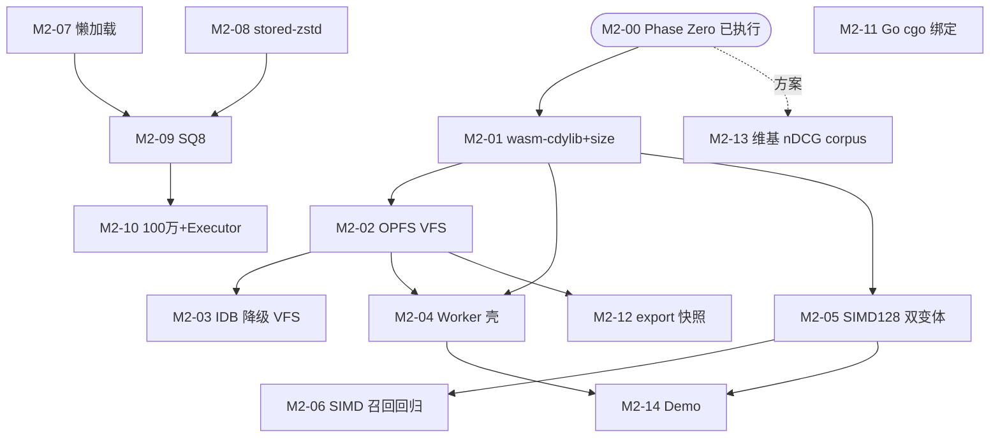

# Vane M2 实现计划索引

> 本文件是 M2 阶段编排者的调度依据，也是各计划之间类型签名的**单一事实源**。
> 任何跨计划的类型/函数名/签名分歧以本文件 `M2 Global Interface Contracts` 节为准。
> M0/M1 既有契约见 `docs/plans/m0/README.md` 与 `docs/plans/m1/README.md`（不重复；M2 计划消费 M0/M1 pub API 须引用其精确签名）。
> SPEC 节号引用 `docs/SPEC.md` **v1.2**（懒加载 + per-file format_version + I-5 释义三处修订已用户批准）；需求引用 `docs/REQUIREMENTS.md` v1.1。

---

## 计划文件清单

| # | 文件 | 一句话摘要 | 产出模块 | 前置 |
|---|---|---|---|---|
| 00 | （Phase Zero 已执行，无独立计划） | parked minors + vane-wasm 骨架；状态见 `m2-00-*-report.md` | — | 无 |
| 01 | `modules/M2-01-wasm-cdylib-size.md` | vane-wasm 真实检索 API 胶水 + SIMD 探针占位 + 800KB 门禁强制（CI 切到 vane-wasm） | `crates/vane-wasm` | M2-00 骨架 |
| 02 | `modules/M2-02-opfs-vfs.md` | `OpfsVfs` 实现 Vfs trait（单 OPFS 容器 + 内存 overlay，Worker 内同步） | `crates/vane-wasm`（feature-gated） | M2-01 |
| 03 | `modules/M2-03-idb-vfs.md` | `IdbVfs` 降级适配层（复用 overlay 内核，内存 Vec + 异步 checkpoint，不抛错） | `crates/vane-wasm` | M2-02 |
| 04 | `modules/M2-04-worker-shell.md` | Dedicated Worker 壳 + postMessage Promise 边界 + init 探针 | `crates/vane-wasm`（Worker JS 胶水） | M2-01, M2-02 |
| 05 | `modules/M2-05-simd128-variants.md` | wasm simd128 默认 / scalar fallback 双产物 + init `WebAssembly.validate` 探针 | `crates/vane-wasm` + 构建脚本 | M2-01 |
| 06 | `modules/M2-06-simd-recall-regression.md` | 两变体各跑 recall@10≥0.95 五档回归 | `tests/` + CI | M2-05 |
| 07 | `modules/M2-07-lazy-load.md` | SegmentReader OnceLock 按需加载 vectors/stored，open<1s | `vane_core::segment` | SPEC v1.2（已批准） |
| 08 | `modules/M2-08-stored-zstd.md` | stored.bin v2 zstd + per-file format_version + 双模读取 + zstd-encode feature | `vane_core::segment` + `types.rs` | SPEC v1.2（已批准） |
| 09 | `modules/M2-09-sq8.md` | f32→SQ8 量化解编码 + 距离适配，内存 <200MB | `vane_core::vector` + `segment` | M2-07 |
| 10 | `modules/M2-10-million-executor.md` | Executor trait + rayon 并行搜索（cfg 仅在 impl）+ 100万压测 | `vane_core::executor` + api | M2-09 |
| 11 | `modules/M2-11-go-cgo-binding.md` | vane-ffi C ABI 实装（M0 占位 stub）+ cbindgen + staticlib + zig cc + wazero build tag | `crates/vane-ffi` + `bindings/go` | M1 既有（无新前置） |
| 12 | `modules/M2-12-export-snapshot.md` | `Db::export(destPath)` 单文件快照实装（M0/M1 占位 E_UNSUPPORTED） | `vane_core::api` + 可能 vane-wasm | M2-02（OPFS 写快照） |
| 13 | `modules/M2-13-wiki-ndcg-corpus.md` | 真实中文维基 500 篇 + 50 查询 fixture + nDCG 验收② | `crates/vane-core/tests/fixtures/` + CI | M2-00 方案 |
| 14 | `modules/M2-14-demo.md` | 纯前端拖入 markdown 文件夹本地混合搜索（含中文） | `examples/` 或 `demo/` | M2-04, M2-05 |

---

## 依赖图（拓扑序）



### 拓扑批次（worktree 不可用→实际串行 + 审查/实现重叠流水线）

| 批次 | 计划 | 可并行（若 worktree 可用） | 说明 |
|---|---|---|---|
| L0 | M2-07 懒加载, M2-08 stored-zstd, M2-11 Go cgo | **3 路并行** | 互相独立；M2-07/08 已 SPEC-gated 解锁，M2-11 独立链 |
| L1 | M2-01 wasm-cdylib+size | 单独（M2-00 骨架已完成） | 浏览器链起点；M2-13 维基 corpus 方案已备可同批推进 |
| L2 | M2-02 OPFS, M2-05 SIMD128, M2-13 维基 corpus | **3 路并行** | M2-02/05 需 M2-01；M2-13 独立 |
| L3 | M2-03 IDB, M2-04 Worker, M2-06 SIMD 回归, M2-09 SQ8 | **4 路并行** | M2-03/04 需 M2-02；M2-06 需 M2-05；M2-09 需 M2-07+M2-08 |
| L4 | M2-10 100万+Executor, M2-12 export | **2 路并行** | M2-10 需 M2-09；M2-12 需 M2-02 |
| L5 | M2-14 Demo | 单独 | 需 M2-04+M2-05 |

**最大并行度（理论）**：L2/L3 阶段 3~4 路并行。**实际**：worktree 不可用，按主 Agent 串行 TDD + 审查/实现重叠流水线推进（同 M1 模式）。

**降级顺序**（燃尽图告急时，REQUIREMENTS §7 风险 #15 + 风险 #3/#11）：
1. **不让位**：M2-01（wasm deliverable 是 M2 合同核心）、M2-07（懒加载解锁 <1s 承诺 + M2-09 前置）、M2-11（Go cgo 是 M1 按约后移的合同债务，不得再拖）。
2. **可后移/裁剪**：M2-14 Demo（产品演示非正确性门禁）→ M2-06（SIMD 回归可与 M2-05 合并最小覆盖）→ M2-03（IDB 降级，OPFS 主路径已够验收，降级可延后）。
3. **不可后移**：M2-01 的 800KB 门禁、M2-07 的 open<1s 实测、M2-08 的 corpus 兼容测试、M2-11 的 Go 交叉矩阵（质量门禁是合同）。

---

## M2 范围边界

### M2 实现
- 浏览器交付：vane-wasm cdylib + 真实检索 API 胶水 + OPFS 主 VFS + IDB 降级 VFS + Dedicated Worker 壳 + SIMD128/scalar 双变体（init 探针选择）。
- WASM 词典：CDN URL fetch → sha256 校验 → OPFS 缓存；`dictData` 内联注入；fetch 失败降级 bigram + console.warn（不抛错）。
- 冷启动懒加载（SPEC v1.2 修订 A）：SegmentReader OnceLock 按需加载 vectors/stored，open<1s。
- stored.bin zstd + per-file format_version（SPEC v1.2 修订 B + I-5 释义澄清）：v2 zstd 块 + v1/v2 双模读取 + per-file version 常量 + zstd-encode feature。
- SQ8 向量量化（f32→SQ8，内存 <200MB）。
- 100 万规模承诺恢复（Executor trait + rayon 并行搜索，cfg 仅在 Executor impl）。
- Go cgo 绑定（vane-ffi C ABI 实装 + cbindgen + staticlib + zig cc 交叉 + wazero build tag）—— M1 按约后移，M2 必须落地。
- `Db::export(destPath)` 单文件快照（M0/M1 占位 E_UNSUPPORTED → M2 实装）。
- 真实中文维基 nDCG corpus（500 篇 + 50 查询 fixture，验收②）。
- Demo：纯前端拖入 markdown 文件夹本地混合搜索（含中文）。

### M2 仅 API 占位（保留 E_UNSUPPORTED）
- 无。M2 把 M0/M1 留下的 `Db::export` 占位落实。

### M2 不实现（post-M2 / Won't-have）
- 内置 embedding / GPU / SQL / 分布式 / 服务端模式（Won't-have，不得触碰）。
- jieba 完整词典作为 native 可选 feature（REQUIREMENTS §7 列为 M2；本里程碑评估，若体积/CI 余量不足则 post-M2，不阻塞）。
- mmap 只读模式（Could-have，附加）。
- 韩文/日文专用分词词典（Could-have）。

---

## M2 Global Interface Contracts

> 以下签名是 M2 各计划之间**唯一的沟通渠道**。定义它的计划标 `Produced by`，消费它的计划标 `Consumes from`。
> 所有类型位于 `vane_core` crate，路径前缀 `vane_core::`，除非另注 crate。M0/M1 既有契约（Vfs/Schema/SegmentReader/SegmentWriter/brute_search/InvertedIndexReader/ManifestStore/HnswReader/MergeTask/compile_filter/Wal/JiebaTokenizer/ReindexHandle/vane-ffi C ABI 占位等）见 M0/M1 README，此处不重复，仅列 M2 新增/扩展。

### M2-07 懒加载产出（`vane_core::segment` 内部行为变更，**不改 §4 IDL 签名**）

```rust
// crates/vane-core/src/segment/mod.rs
// SegmentReader 字段改为 OnceLock（内部可变，&self 签名不变）：
pub struct SegmentReader {
    meta: SegmentMeta,
    vfs: Arc<dyn Vfs>,
    segment_dir: String,
    vectors: std::sync::OnceLock<Vec<f32>>,          // 懒加载（M2-07）
    dim: u32,                                        // open 时从 vectors.bin 头读（v2 头含 dim；v1 回退从 payload 长度反推）
    id_map: std::collections::HashMap<u64, String>,  // open 时加载（外部 id 反查必需）
    stored: std::sync::OnceLock<std::collections::HashMap<u64, StoredReadEntry>>,  // 懒加载（M2-07）
}
impl SegmentReader {
    pub fn open(vfs: &Arc<dyn Vfs>, segment_dir: &str) -> Result<Self>;  // 签名不变（mod.rs:344）；open 仅读 header+idmap+manifest
    pub fn vectors(&self) -> &[f32];   // 签名不变（mod.rs:417）；首次调用 get_or_init 触发 read_all+decode
    pub fn dim(&self) -> u32;          // 签名不变（mod.rs:420）
    pub fn stored_json(&self, local_docid: u64) -> Option<&str>;  // 签名不变（mod.rs:442）；首次触发 stored 加载
    pub fn text(&self, local_docid: u64) -> Option<&str>;         // 签名不变（mod.rs:450）；首次触发 stored 加载
}
```

**dim 来源（vectors.bin v2 头）**：`vectors.bin` 头从 v1 `magic(4)|version(4)`（8 字节）扩展为 v2 `magic(4)|version(4)|dim(4 LE)`（12 字节）。open 读 dim：v2 直接取头；v1（旧段）回退 `payload_len / doc_count`。**vectors.bin format_version 由 M2-08 per-file 化，v1→v2 在 M2-08 落地**（M2-07 与 M2-08 协同：M2-07 实现读 dim 的逻辑，M2-08 落实 vectors.bin v2 头写入与 per-file 常量；两计划 L0 同批推进时 M2-07 测试可用 stub header，M2-08 落实后回归）。

**Consumes from M0/M1**：`SegmentReader::open`/`vectors`/`dim`/`stored_json`/`text`（签名不变，M0/M1 冻结）；`read_all` 辅助；`header::decode_header`。Consumes from M2-08：`vectors.bin` v2 头含 dim 字段（per-file `VECTORS_FORMAT_V2`）。

**Produces for**：M2-09（SQ8 量化层挂在懒加载的 vectors 访问点 `vectors()` 上）；M2-10（Executor 并行搜索消费 `vectors()`）；M2-12（export 读段 vectors 走 `vectors()`）。

### M2-08 stored-zstd + per-file format_version 产出（`vane_core::types` + `vane_core::segment`）

```rust
// crates/vane-core/src/types.rs（新增 per-file 常量，保留 FORMAT_VERSION 作全库 schema 版本）
pub const HEADER_FORMAT_V1: u32 = 1;
pub const VECTORS_FORMAT_V1: u32 = 1;
pub const VECTORS_FORMAT_V2: u32 = 2;   // +dim(4 LE) 头字段（M2-07 dim 来源）
pub const STORED_FORMAT_V1: u32 = 1;    // 裸 JSON（M0/M1 产物，双模读取保留）
pub const STORED_FORMAT_V2: u32 = 2;    // zstd 块压缩（M2 起，native/node 写，wasm 读）
pub const IDMAP_FORMAT_V1: u32 = 1;
pub const SCALARS_FORMAT_V1: u32 = 1;
pub const HNSW_FORMAT_V1: u32 = 1;

// crates/vane-core/Cargo.toml [features]
// zstd-encode = ["dep:zstd"]      // 写期编码（native/node 启用，wasm32 check 不启）
// zstd-decode = ["dep:ruzstd"]    // 读期解码（默认启用，wasm32 也启，支持 v2 跨平台读取）
// jieba = ["zstd-decode"]         // jieba 复用 ruzstd 解码 dict.bin（原 jieba=["ruzstd"] 调整为 zstd-decode 别名）

// crates/vane-core/src/segment/mod.rs
// finalize 写 stored.bin（mod.rs:212-228）：cfg(feature="zstd-encode") 走 v2 zstd 块；否则落 v1 裸 JSON。
// decode_stored（mod.rs:509）：按 version 分支——v1 原路径；v2 读 raw_payload_len + zstd_block → ruzstd 解压 → 走 v1 解码逻辑。
// stored.bin v2 布局：
//   magic(4) | format_version(4 LE)=2 | raw_payload_len(4 LE) |
//   zstd_block_len(4 LE) | zstd_block_bytes...
//   （raw_payload = v1 布局 count + {docid|text_len|text|meta_len|meta}...）
```

**I-5 释义（SPEC v1.2 已澄清）**：`cfg(feature="zstd-encode")` 是存储编解码能力开关，允许出现在 segment 编解码处；`cfg(target)` 平台分支仍仅限 VFS/Executor。M2-08 严格遵守：不引入 `cfg(target)`。

**Consumes from M0/M1**：`MAGIC`、`FORMAT_VERSION`（保留）、`decode_stored`/`finalize` 既有结构。Consumes from M2-07：vectors.bin v2 头含 dim（M2-07 读 dim 逻辑依赖 M2-08 写 v2 头）。

**Produces for**：M2-12（export 快照含 stored v2 段读写）；M2-13（维基 corpus 跨平台 v2 兼容测试）。

### M2-02 OPFS VFS 产出（`crates/vane-wasm`，feature-gated，实现 `vane_core::vfs::Vfs`）

```rust
// crates/vane-wasm/src/vfs/opfs.rs（feature = "opfs"）
// 实现 SPEC §6.1 Vfs trait（M0 冻结签名，crates/vane-core/src/vfs/mod.rs:5-13）：
//   create / read_at / write_at / append / sync / rename / delete / list
// 物理实现：单 OPFS 容器文件 vane.db + 内存虚拟 FS overlay（MemOverlay）
//   - Worker init 异步获取唯一 FileSystemSyncAccessHandle（createSyncAccessHandle 一次性 await）
//   - 此后全部 Vfs 方法基于该同步句柄操作容器内字节区间
//   - 虚拟路径 <db>/segments/seg_<ulid>/... 映射到容器 (offset,size) 区间
//   - manifest 原子性（I-6）靠容器内双 meta_slot + CRC 等价实现，对 core 透明
//   - core / Vfs trait 零改动（设计依据 docs/plans/m2/opfs-vfs-design.md 路径 A）
pub struct OpfsVfs { /* sah: FileSystemSyncAccessHandle, overlay: MemOverlay */ }
impl OpfsVfs {
    pub fn from_handle(sah: web_sys::FileSystemSyncAccessHandle) -> Result<Self>;  // Worker init 异步获取 sah 后传入
}
impl vane_core::vfs::Vfs for OpfsVfs { /* 8 方法，委托 MemOverlay（全同步） */ }

// crates/vane-wasm/src/vfs/overlay.rs（后端无关内核，M2-03 复用）
pub trait OverlayBackend: Send + Sync { fn read/write/flush/size/truncate }
pub struct MemOverlay { /* file_table + free_list + 双 meta_slot + generation + CRC */ }
```

**Consumes from M0**：`vane_core::vfs::Vfs` trait（M0 冻结，`vfs/mod.rs:5-13`，**签名零改动**）。Consumes from M2-01：vane-wasm cdylib + 体积门禁。设计依据：`opfs-vfs-design.md`（路径 A，已评审）。

**Produces for**：M2-03（IDB 降级 VFS 复用 `MemOverlay` + `OverlayBackend` 内核）；M2-04（Worker 壳注入 Vfs 实例，init 异步序列）；M2-12（export 直接读容器区间拼接，或 dump 整个容器 blob）。

### M2-03 IDB 降级 VFS 产出（`crates/vane-wasm`，feature-gated）

```rust
// crates/vane-wasm/src/vfs/idb.rs（feature = "idb"）
// OPFS 不可用时降级（SPEC §6.1/§10 E_UNSUPPORTED 禁止到达：自动降级不抛错，REQUIREMENTS §4.1）
// 适配层在 binding crate（vane-wasm），不污染 core（SPEC §6.1）
// 复用 M2-02 MemOverlay + OverlayBackend 内核（后端无关）；底层换内存 Vec + 异步 checkpoint
pub struct IdbVfs { /* overlay: MemOverlay, backend: 内存 Vec<u8>, dirty: AtomicBool */ }
impl OverlayBackend for IdbBackEnd { /* read/write/size/truncate 操作内存 Vec；flush 标 dirty */ }
impl IdbVfs {
    pub fn from_blob(blob: Vec<u8>) -> Result<Self>;  // Worker init 异步从 IDB 读取容器 blob
}
impl vane_core::vfs::Vfs for IdbVfs { /* 8 方法，委托 MemOverlay（全同步） */ }
```

**注**：IndexedDB 原生异步，core 要求同步 IO（REQUIREMENTS §4.1）。IDB 降级 VFS 实现策略：**复用 M2-02 overlay 内核**（`MemOverlay` + `OverlayBackend`，后端无关），底层后端换为内存 `Vec<u8>`（容器映像）+ 异步 checkpoint。`sync(path)` best-effort（标 dirty，由 JS 壳层异步 tick 把内存 blob put 回 IDB，不保证 sync 返回时已落盘）。I-6 语义降级为「尽力持久化」（崩溃可能丢未 checkpoint 写入），关键数据走 `export()` 快照（M2-12）。详见 M2-03 计划。

**Consumes from M0**：`Vfs` trait。Consumes from M2-02：`MemOverlay` + `OverlayBackend` 内核（共享）+ OPFS 不可用降级路径。

**Produces for**：M2-04（Worker init 探针选择 OPFS/IDB）。

### M2-04 Worker 壳产出（`crates/vane-wasm` Worker JS + Rust 胶水）

```rust
// crates/vane-wasm/src/worker.rs（feature = "worker"）
// Dedicated Worker 壳（REQUIREMENTS §4.1：OPFS 强制 Worker 架构）
// postMessage Promise 边界：主页面 async ↔ Worker 同步 core（REQUIREMENTS §4.1）
// init 探针：WebAssembly.validate(simd128 module) 选 SIMD/Scalar 产物（M2-05 协同）
#[wasm_bindgen]
pub struct VaneWorker { /* 内部 Db/Collection 句柄 + Vfs 实例 */ }
#[wasm_bindgen]
impl VaneWorker {
    #[wasm_bindgen(constructor)]
    pub fn new(opts: serde_json::Value) -> Promise;  // init：选 Vfs（OPFS/IDB）+ 加载词典（CDN/内联/降级）
    pub fn open(&self, path: String, opts: serde_json::Value) -> Promise;
    pub fn collection(&self, name: String, schema: serde_json::Value, opts: serde_json::Value) -> Promise;
    pub fn add(&self, col: u32, docs: serde_json::Value) -> Promise;
    pub fn flush(&self, col: u32) -> Promise;
    pub fn search(&self, col: u32, query: serde_json::Value) -> Promise;
    pub fn delete(&self, col: u32, ids: serde_json::Value) -> Promise;
    pub fn compact(&self, col: u32) -> Promise;
    pub fn reindex(&self, col: u32) -> Promise;
    pub fn export(&self, dest: String) -> Promise;
    pub fn close(&self) -> Promise;
}
```

**Consumes from M0/M1**：`Db`/`Collection` 全部 pub API（`api/db.rs`/`api/collection.rs`）。Consumes from M2-02/03：Vfs 实例。Consumes from M2-05：SIMD 探针选产物。

**Produces for**：M2-14（Demo 消费 Worker API）。

### M2-05 SIMD128 双变体产出（`crates/vane-wasm` 构建脚本 + init 探针）

```rust
// crates/vane-wasm/src/simd_probe.rs
// init 时 WebAssembly.validate(simd128 module) 探针（REQUIREMENTS §4.1/§3.6，SPEC §12.2）
// 两产物：vane_wasm_simd.wasm（RUSTFLAGS="-Ctarget-feature=+simd128"）/ vane_wasm_scalar.wasm（默认）
// 用户只下载其一（SPEC §12.2）
pub fn simd128_supported() -> bool;  // Worker init 调用，选 import 哪个产物
```

**Consumes from M2-01**：vane-wasm cdylib 构建管线。

**Produces for**：M2-04（Worker init 探针）；M2-06（双变体召回回归）。

### M2-09 SQ8 量化产出（`vane_core::vector` + `segment` 扩展）

```rust
// crates/vane-core/src/vector/sq8.rs（feature = "sq8"，可选）
// f32→SQ8 标量量化编码/解码 + 距离适配（SPEC §13.1 <200MB，REQUIREMENTS §2 Should have）
pub fn encode_sq8(vectors: &[f32], dim: u32) -> Vec<u8>;       // 每维 1 字节（min/max + 256 级量化）
pub fn decode_sq8(sq8: &[u8], dim: u32) -> Vec<f32>;           // 解码回 f32（精确距离计算时）
pub fn sq8_distance(sq8_a: &[u8], sq8_b: &[u8], dim: u32, metric: Metric) -> f32;  // 近似距离（不解码，快速；覆盖 cosine/L2/dot）
pub fn brute_search_sq8(sq8: &[u8], dim: u32, query: &[f32], metric: Metric, topk: usize, filter: Option<&roaring::RoaringBitmap>, docid_base: u64) -> Vec<ScoredDoc>;
//   签名与 brute_search（vector/mod.rs:101）对齐补 metric + docid_base（reviewer A-I3/B-I2）
// SegmentReader 扩展（不改 vectors() 签名）：
//   vectors() 仍返 &[f32]；新增 sq8_vectors() -> Option<&[u8]>（懒加载，feature-gated）
//   HNSW search 路径：若 sq8_vectors 可用，导航用 sq8_distance，结果距离用 decode 精算
```

**Consumes from M2-07**：懒加载 vectors 访问点（`vectors()`），SQ8 量化层挂在同一路径。

**Produces for**：M2-10（100万规模依赖 SQ8 降内存）。

### M2-10 Executor + 100万产出（`vane_core::executor`，cfg 仅在 impl）

```rust
// crates/vane-core/src/executor/mod.rs
// SPEC §11 Executor trait（native=rayon, wasm=串行）。cfg 只在 impl（I-5）。
pub trait Executor: Send + Sync {
    fn scope<R>(&self, f: impl FnOnce(&Scope) -> R) -> R;
}
pub struct Scope<'a> { /* rayon::Scope 或 串行 */ }
impl Scope<'_> {
    pub fn spawn(&self, task: impl FnOnce() + Send);
}
// native impl（cfg(not(target_arch="wasm32"))）：包装 rayon::scope
// wasm impl（cfg(target_arch="wasm32")）：串行执行（spawn 立即调用）
// api/collection.rs search 路径改用 Executor.scope 并行搜各段 → 归并
```

**I-5 守护**：`cfg(target_arch="wasm32")` 仅出现在 `executor/mod.rs`（`default_executor()` 工厂 + 两个 impl 块）+ `vfs/mod.rs:18`（std_fs 模块，已有 M0）；`api/db.rs` 仅调 `default_executor()` 工厂无 `cfg(target)`；核心算法（HNSW/BM25/fusion）零 cfg。rayon 仅在 native Executor impl 引入，不进 core 算法。

**Consumes from M2-09**：SQ8 降内存后 100万可行。Consumes from M0/M1：`HnswReader::search`（`hnsw/mod.rs:624`）、`compile_filter`（`filter/mod.rs:32`）。

**Produces for**：M2-14（Demo 大规模场景）。

### M2-11 vane-ffi C ABI 产出（`crates/vane-ffi` + `bindings/go`）

```rust
// crates/vane-ffi/src/lib.rs（当前为 M0 占位 stub："// M0 占位；FFI 实现见 M1 计划。"）
// M2-11 实装 M1 README §09 契约（句柄注册表 std::sync::RwLock<HashMap>，非 dashmap）
// 函数面（M1 README §09 已定稿，M2 落地）：
pub fn vane_open(path_ptr: *const u8, path_len: usize, opts_json: *const u8, opts_len: usize, out_handle: *mut u64) -> i32;
pub fn vane_collection(db_h: u64, name: *const u8, name_len: usize, schema_json: *const u8, schema_len: usize, out_handle: *mut u64) -> i32;
pub fn vane_add(col_h: u64, docs_json: *const u8, docs_len: usize) -> i32;
pub fn vane_flush(col_h: u64) -> i32;
pub fn vane_search(col_h: u64, query_json: *const u8, query_len: usize, out_arena: *mut *mut u8, out_len: *mut usize) -> i32;
pub fn vane_delete(col_h: u64, ids_json: *const u8, ids_len: usize, out_count: *mut u64) -> i32;
pub fn vane_compact(col_h: u64) -> i32;
pub fn vane_reindex(col_h: u64, out_handle: *mut u64) -> i32;
pub fn vane_reindex_progress(h: u64, out_progress: *mut f32) -> i32;
pub fn vane_reindex_wait(h: u64) -> i32;
pub fn vane_load_dict(h: u64, dict_ptr: *const u8, dict_len: usize) -> i32;
pub fn vane_dict_version(out_ptr: *mut *mut u8, out_len: *mut usize) -> i32;
pub fn vane_export(db_h: u64, dest_ptr: *const u8, dest_len: usize) -> i32;  // M2-12 接入实装
pub fn vane_close(handle: u64) -> i32;
pub fn vane_last_error_message(handle: u64) -> *const u8;
pub fn vane_string_free(ptr: *mut u8);
// cbindgen 生成 bindings/go/vane.h + vane.go（cgo 包装）
// zig cc 交叉编译全平台 .a；CGO_ENABLED=0 编译错误引导 wazero；-tags wazero 切换
```

**Consumes from M0/M1**：全部 `vane_core::api` pub API（`Db::open(vfs: Arc<dyn Vfs>, path, opts)` `api/db.rs:35`、`Db::collection`、`Db::export` `api/db.rs:164`、`Db::close` `api/db.rs:168`、`Collection::{add,flush,search,delete,compact,reindex}`、`ReindexHandle`）。Consumes from M2-12：`Db::export` 实装（`vane_export` 接入）。

**Produces for**：Go 绑定链（`bindings/go` cgo 包装）。

### M2-12 export 快照产出（`vane_core::api` 扩展）

```rust
// crates/vane-core/src/api/db.rs:164（当前占位 Err(VaneError::Unsupported)）
// M2-12 实装为 SPEC §4.1 export(destPath)->Result<()>
impl Db {
    pub fn export(&self, dest: &str) -> Result<()>;  // 签名不变（db.rs:164）；实装打包单文件快照
}
// 快照格式（SPEC §4.1 "单文件快照"，具体格式 M2-12 定义）：
//   magic(4)="VANE_SNAP" | version(4 LE) | num_files(4 LE) |
//   { path_len(4 LE) | path_bytes | file_len(8 LE) | file_bytes }...
// 遍历 manifest + 全部段文件 + wal.log → 打包写 dest（经 Vfs::write_at）
// 恢复路径 read_snapshot：解包单文件快照到 db_path 目录 → Db::open(vfs, db_path, opts)（P0-3 数据主权闭环）
pub fn write_snapshot(vfs: &dyn Vfs, db_path: &str, dest: &str) -> Result<()>;
pub fn read_snapshot(vfs: &dyn Vfs, src: &str, db_path: &str) -> Result<()>;  // 恢复（M2-12 实装，非可选）
```

**Consumes from M0/M1**：`Db` 内部 manifest/段路径、`Vfs` trait。Consumes from M2-02：OPFS 写快照（wasm 端 export）。

**Produces for**：M2-11（`vane_export` C ABI 接入）；vane-node `ExportTask`（既有 `crates/vane-node/src/db.rs:110`，M2-12 后从 E_UNSUPPORTED 变真实导出）。

### M2-13 维基 nDCG corpus 产出（`crates/vane-core/tests/fixtures/wiki_zh/` + CI）

```rust
// fixtures/wiki_zh/corpus.json: 500 篇 {id, text}（200~2000 字，科技/历史/地理）
// fixtures/wiki_zh/queries.json: 50 查询 {qid, text}（2~4 字，实体/概念/边界歧义）
// fixtures/wiki_zh/qrels.json: {qid: {docid: rel}}（top-10 人工/半自动标注）
// tests/ndcg_wiki_zh.rs: 加载 fixture → jieba collection → 50 查询 → nDCG@10
//   断言：jieba vs bigram 提升 ≥15%；jieba vs jieba-rs 完整版（dev-dep）差 <2%（SPEC §13.2-2）
```

**Consumes from M1**：`JiebaTokenizer`（`tokenizer/jieba/mod.rs:28`）、`JiebaDict::load`（`dict.rs:46`）。

**Produces for**：CI jieba-nDCG job 切换到维基 fixture（M1 边界歧义语料保留为回归对照）。

---

## 全局约束表（SPEC §13.3 工程纪律门禁 + M2 新增，每份计划必须遵守）

| 约束 | 值 | 来源 |
|---|---|---|
| core 禁 `std::fs`/`std::net`/mmap | CI 门禁 + `scripts/check-no-std-fs.sh` | §6.1/§13.3 |
| `cfg(target)` 只允许在 VFS/Executor impl | 核心算法零 `cfg(target)` | §11/I-5（v1.2 澄清） |
| `cfg(feature)` 允许在 segment 编解码（如 zstd-encode/sq8） | 能力开关，非平台分支 | §14 I-5 注（v1.2 新增） |
| 依赖黑名单 | regex / tokio / prost / tonic / openssl / lindera / ndarray / wee_alloc / dashmap / parking_lot | §4.1/§13.3 |
| BM25 k1 / b | 1.2 / 0.75（冻结） | §6.3 |
| RRF k | 60（冻结） | §8.2 |
| 段数上限 | 10（超限强制合并） | §3.3 |
| dim 上限 | 4096 | §3.1 |
| 单文档上限 | 16MB | §3.2 |
| topK 上限 | 1000 | §4.2 |
| 用户词表上限 | 10 万词条 | §5.3 |
| manifest 原子切换 | 临时文件 → sync → rename | §6.4/I-6 |
| 并发原语 | core 统一 `std::sync::RwLock`/`Mutex`/`OnceLock` | §13.3 |
| wasm32 check | `cargo check --target wasm32-unknown-unknown -p vane-core` + `-p vane-wasm` | §13.3 |
| **M2：词典数据永不进 wasm** | 核心 wasm gzip ≤800KB（含 jieba 代码、不含词典数据） | §13.2-3/红线 |
| **M2：vane-wasm default features 不启 dict-zh**（红线） | **永不启用 `dict-zh`**（dict-zh 捆绑 `vane-dict-zh` 词典数据进产物，红线）；`jieba` feature（仅算法代码 DAT/HMM/seg，无词典数据）可在 vane-wasm 非 default 启用，但须通过 800KB 门禁实测（A-I5 放宽 M1 约束：M1 措辞「永不启 jieba feature」门控了算法代码本身，与 M2-04/M2-14 浏览器 jieba 检索冲突；M2 Prompt 明确「含 jieba 代码、不含词典数据」） | §4.1/红线 |
| **M2：wasm 体积预算累计管理**（B-I5） | vane-core + wasm-bindgen + web-sys + jieba 算法 + ruzstd + overlay 内核总和 ≤800KB gzip；每模块贡献登记体积评估表，落地时实测更新 | §13.2-3 |
| **M2：浏览器目标 wasm32-unknown-unknown**（不引 wasi） | OPFS 主 + IDB 降级（适配层在 vane-wasm，不污染 core） | §4.1/§6.1 |
| **M2：core 保持同步 IO** | SyncAccessHandle 在 Worker 内同步；异步只在 postMessage 边界 | §4.1 |
| **M2：SIMD 双变体** | simd128 默认 + scalar fallback，init `WebAssembly.validate` 探针 | §12.2/§3.6 |
| **M2：WASM 词典 fetch** | CDN URL → sha256 校验 → OPFS 缓存；失败降级 bigram + console.warn（不抛错，E_DICT_UNAVAILABLE 禁到达） | §12.3/§12.4 |
| **M2：SQ8 feature 可选** | 10万×384 全加载 <200MB | §13.1 |
| **M2：rayon 仅 Executor impl** | 不进 core 算法；cfg(target) 仅 executor/mod.rs | §11/I-5 |
| **M2 新依赖登记** | wasm-bindgen / web-sys / js-sys（vane-wasm）+ ruzstd（core 默认，zstd-decode）+ zstd（core optional，zstd-encode）+ rayon（core optional，Executor native）+ cbindgen（vane-ffi build） | 体积评估见各计划 |

### 新依赖体积评估（M2 引入，累计管理 B-I5）

> **累计预算**：vane-core baseline + 下表各依赖增量总和 ≤800KB gzip。每模块落地时实测更新本表。web-sys 多 feature（opfs+idb+worker）叠加体积非线性，需实测三 feature 同时启用值。jieba 算法代码（feature 启用时）+ ruzstd + overlay 内核累加后余量紧张，落地时优先实测。

| 依赖 | 引入点 | 体积影响（gzip 估） | 门禁 |
|---|---|---|---|
| wasm-bindgen 0.2 | vane-wasm | +10~20KB（M2-00 实测 default 9.46KB 含胶水） | ≤800KB |
| web-sys / js-sys | vane-wasm（feature-gated：opfs/idb/worker） | +30~80KB（按启用 feature；三 feature 同启实测） | ≤800KB，cargo bloat 周报 |
| wasm-bindgen-futures | vane-wasm（feature=worker，B-I4） | +5~15KB（Promise/Future 桥接） | ≤800KB，M2-04 实测登记 |
| ruzstd 0.5 | vane-core（zstd-decode，默认启） | +30~60KB | ≤800KB（M2-08 实测确认） |
| zstd 0.13 | vane-core（zstd-encode，optional，native/node 启） | 不进 wasm | wasm32 check 不启 |
| rayon 1.x | vane-core（Executor native impl，optional） | native only，不进 wasm | wasm32 check 不启 |
| jieba 算法代码 | vane-core（feature=jieba，DAT/HMM/seg，无词典数据） | 待实测（非 default，启用时登记） | ≤800KB 实测门禁 |
| overlay 内核 | vane-wasm（M2-02 MemOverlay + container，纯 Rust 无依赖） | <5KB（手写 CRC，无新 crate） | ≤800KB |
| cbindgen | vane-ffi build-dep | 不进运行时 | 仅构建期 |

---

## 不变量覆盖矩阵（I-1~I-8，M2 负责部分高亮）

| 不变量 | M0/M1 负责 | M2 负责计划 | M2 测试要求 |
|---|---|---|---|
| I-1 段不可变 | 04-segment-format, 00-text-persistence, 01-hnsw, 02-tombstone-merge | **M2-08 stored-zstd**, M2-09 SQ8 | stored v2 仍 finalize 一次性写入；SQ8 量化层不写回段文件（只读缓存） |
| I-2 双索引原子可见 | 07-api-core, 08-persistence, 02-tombstone-merge | — | （M2 无新增可见性路径） |
| I-3 图不原地删 | 01-hnsw, 02-tombstone-merge | — | （M2 不改 HNSW 删除语义） |
| I-4 单一分词身份 | 02-tokenizer, 07-api-core, 06-userdict-reindex | — | （M2 不改词表状态机） |
| I-5 核心零平台分支 | 00-workspace, 10-ci-gates, 10-ci-m1 | **M2-08 stored-zstd**, M2-10 Executor | `cfg(feature)` 仅在 segment 编解码（zstd-encode/sq8）；`cfg(target)` 仅在 executor/mod.rs + vfs impl；core 算法零 cfg；CI grep 门禁 |
| I-6 manifest 原子性 | 08-persistence, 04-wal | M2-12 export | export 快照读 manifest 一致快照；不破坏 manifest 原子切换 |
| I-7 FFI 内存铁律 | 09-go-cgo-binding（M1 占位） | **M2-11 Go cgo 绑定** | 句柄注销后使用=明确错误非 UB；arena 一次 free；谁分配谁释放 |
| I-8 binding 薄壳 | 09-node-binding, 09-go-cgo-binding（占位） | **M2-11 Go cgo 绑定**, M2-04 Worker 壳 | cgo/Worker 无检索逻辑；行为测试在 core |

---

## 阶段性偏离（M2 → post-M2，需在此显式注明）

1. **M2-03 IDB 降级 sync 语义降级**：IndexedDB 原生异步，core 要求同步 IO。实现策略为复用 M2-02 overlay 内核（`MemOverlay` + `OverlayBackend`），底层换内存 `Vec<u8>` + 异步 checkpoint，`sync(path)` best-effort（标 dirty，JS 壳层异步 tick put 回 IDB，不保证 sync 返回时已落盘）。I-6 语义降级为「尽力持久化」（崩溃可能丢未 checkpoint 写入），关键数据走 `export()` 快照（M2-12）。性能逊于 OPFS，仅作降级（SPEC §6.1 适配层在 binding crate）。文档明示降级场景性能折损。
2. **M2-07 懒加载范围**：仅 vectors + stored 懒加载；hnsw 维持 open 时加载（hnsw.bin ~60MB，search 必然紧随，收益小）。若 open 仍 >1s 则懒加载 hnsw（post-M2 优化）。SPEC §13.1 降级分级保留为 fallback。
3. **M2-08 stored v2 仅 native/node 写，wasm 读**：wasm 端 flush 落 v1 裸 JSON（浏览器端 stored 体积小，5万文档验收边界，不压缩可接受）；native 写的 v2 段可被 wasm 读（ruzstd 解码）。
4. **M2-09 SQ8 feature 可选**：默认关闭，100万规模场景启用。10万验收边界不强制 SQ8（<500MB 已达标）。
5. **M2-10 Executor 仅 native**：wasm 端 Executor = 串行（现有路径不变）；rayon 仅 native impl。100万压测在 native 进行。
6. **M2-11 wazero build tag**：wazero 形态作二等备选（REQUIREMENTS §4.3），性能劣化 2~4 倍，不承诺与 cgo 版版本同步。
7. **M2-13 维基数据获取**：dump 下载在开发机离线进行，不进 CI 运行时；fixture 提交仓库（~500KB）。

---

## 降级顺序（燃尽图告急时，REQUIREMENTS §7 风险 #3/#11/#15）

1. **不让位**：
   - M2-01 vane-wasm cdylib + 800KB 门禁（wasm deliverable 是 M2 合同核心）。
   - M2-07 懒加载（解锁 §13.1 open<1s 承诺 + M2-09/M2-10 前置）。
   - M2-08 stored-zstd + per-file format_version（消解 SPEC §6.2 张力，已 SPEC-gated）。
   - M2-11 Go cgo 绑定（M1 按约后移的合同债务，不得再拖）。
2. **可后移/裁剪**：
   - M2-14 Demo（产品演示非正确性门禁）。
   - M2-06 SIMD 回归（可与 M2-05 合并最小覆盖：仅 simd128 跑五档，scalar 跑 smoke）。
   - M2-03 IDB 降级（OPFS 主路径已够验收，降级可延后 post-M2）。
3. **不可后移**（质量门禁是合同）：
   - M2-01 的 800KB 门禁、M2-07 的 open<1s 实测、M2-08 的 corpus 兼容测试、M2-11 的 Go 交叉矩阵。
