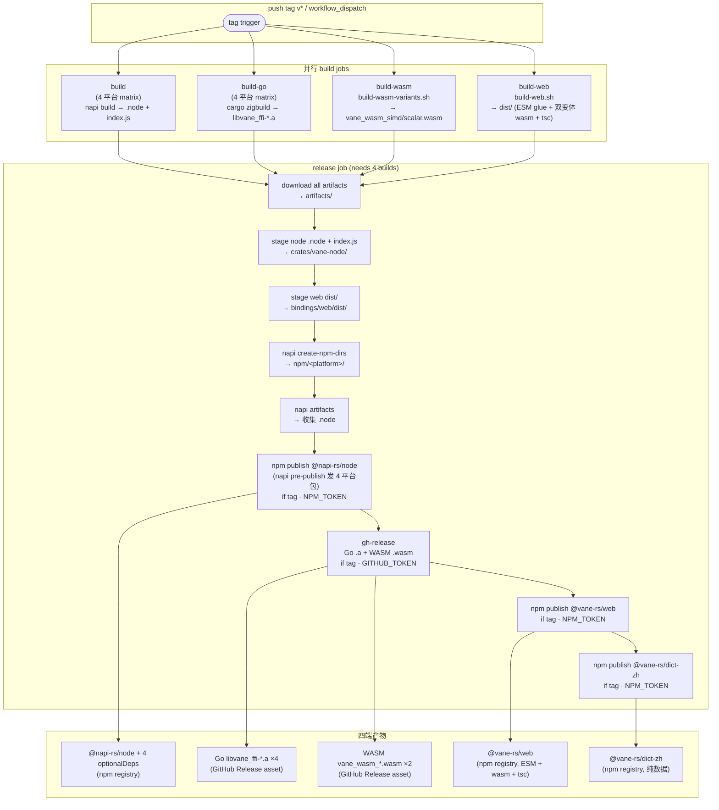

# Task 11 报告：release.yml 扩展 build-web job + @vane-rs/web + @vane-rs/dict-zh npm publish（三端→四端）

- **状态**：✅ 完成
- **分支**：`feat/m3-web-npm`
- **commit**：`4c4e4b6`
- **测试摘要**：`actionlint 1.7.12 exit=0` + `python3 yaml.safe_load` 通过；冻结文件守卫 `git diff --name-only | grep -E 'crates/vane-wasm/|bindings/web/src/|bindings/web/package.json|bindings/web/scripts/|crates/vane-dict-zh/'` 无命中。

---

## 改动说明

仅改 `.github/workflows/release.yml`（+59 行 / -1 行）。4 处编辑：

### 1. 新增 `build-web` job（行 134-165）

与 `build` / `build-go` / `build-wasm` 并行，无 `needs` 依赖。

| 要素 | 值 | 依据 |
|---|---|---|
| runs-on | `ubuntu-latest` | 与 build-wasm 一致 |
| timeout | 30 min | 与其他 build job 一致 |
| Rust toolchain | `dtolnay/rust-toolchain@stable` + `wasm32-unknown-unknown` | build-web.sh 需 cargo build wasm32 |
| rust-cache | `Swatinem/rust-cache@v2` | 复用编译缓存 |
| binaryen | `sudo apt-get install -y binaryen` | build-web.sh `wasm-opt -Oz`（与 build-wasm job 同 step） |
| wasm-bindgen-cli | `cargo install wasm-bindgen-cli --locked --version 0.2.127` | 对齐 Cargo.lock `wasm-bindgen 0.2.127`；ci.yml wasm-recall job（行 317）同模式。CLI 版本必须 == 编译进 .wasm 的 library 版本，否则后处理报版本不匹配 |
| Node | `actions/setup-node@v4` node 20 | build-web.sh 需 `bindings/web/node_modules/.bin/tsc` |
| npm ci | `working-directory: bindings/web`，`npm ci` | package-lock.json 已在仓库（870B），`npm ci` 严格按 lock 安装 typescript devDep |
| 构建 | `bash bindings/web/scripts/build-web.sh` | 脚本 cd 到仓库根；产出 `bindings/web/dist/`（vane_wasm.js/.d.ts + 双变体 .wasm + bg.wasm 别名 + tsc 编译 index/worker/probe/types .js+.d.ts）+ W8 校验 + 体积门禁 gzip ≤800KB |
| artifact | `name: vane-web`，`path: bindings/web/dist/` | upload-artifact@v4 对目录 path 取内容到 artifact 根；下载后 `artifacts/vane-web/` 下是 dist 内文件（无 dist/ 包装） |

### 2. 扩展 `release` job `needs`（行 178）

```diff
-    needs: [build, build-go, build-wasm]
+    needs: [build, build-go, build-wasm, build-web]
```

四端 build job 并行；release 等全部完成。

### 3. 新增 `Stage web dist/` 步骤（行 204-211）

插入位置：`Stage node .node` 之后、`Create npm platform package dirs` 之前。

```yaml
- name: Stage web dist/ into bindings/web/
  run: |
    mkdir -p bindings/web/dist
    cp -r artifacts/vane-web/. bindings/web/dist/
    ls -la bindings/web/dist/
```

**关键细节**：
- `bindings/web/dist/` 被 `.gitignore` 忽略（`dist/` + `.build-tmp/`），release job checkout 后不存在，需 `mkdir -p` 重建。
- `artifacts/vane-web/` 是 download-artifact 下载的 build-web 产物（dist/ 内容在 artifact 根）。
- `cp -r artifacts/vane-web/. bindings/web/dist/` 用 `.` 拷贝目录内容（含隐藏文件）到目标。
- `package.json` + `README.md` + `LICENSE` 由 checkout 提供（在仓库中），不需 artifact 携带 —— 与 node 流水线同模式（node artifact 只携 .node + index.js，不携 package.json）。

### 4. 新增两个 npm publish 步骤（行 243-259）

追加在 `Create GitHub Release` 步骤之后（release job 末尾）。

```yaml
- name: Publish @vane-rs/web to npm
  if: startsWith(github.ref, 'refs/tags/')
  working-directory: bindings/web
  run: npm publish --access public
  env:
    NODE_AUTH_TOKEN: ${{ secrets.NPM_TOKEN }}

- name: Publish @vane-rs/dict-zh to npm
  if: startsWith(github.ref, 'refs/tags/')
  working-directory: crates/vane-dict-zh
  run: npm publish --access public
  env:
    NODE_AUTH_TOKEN: ${{ secrets.NPM_TOKEN }}
```

**关键细节**：
- `if: startsWith(github.ref, 'refs/tags/')` —— 与 @napi-rs/node publish + gh-release 同条件。workflow_dispatch（非 tag）跳过 publish，只验证构建 + staging。
- `--access public` 显式保险（scoped 包默认 restricted；两个 package.json 的 `publishConfig.access` 均已设 `public`，flag 冗余但明确）。
- `setup-node registry-url: https://registry.npmjs.org` 已在 release job 顶部配置（行 188），npm publish 读 `~/.npmrc` 认证。
- `@vane-rs/web`：非 napi 包，不用 `napi create-npm-dirs` / `napi artifacts` / `napi pre-publish`，直接 `npm publish`。package.json `files: ["dist/", "README.md", "LICENSE"]`，npm pack 自动收 dist/ + README + LICENSE + package.json。
- `@vane-rs/dict-zh`：纯数据包，不需 build job。源目录 `data/dict.bin` + `data/sha256_prefix.bin` + `LICENSE` + `package.json` 已在仓库（package.json `files: ["data/dict.bin", "data/sha256_prefix.bin", "LICENSE"]`，README 不在 files 字段 —— 不入包，这是 Task 5 的既定设计，不改）。
- version 不硬编码：npm publish 读各自 package.json version（@vane-rs/web=0.2.0，@vane-rs/dict-zh=2026.8.0）。

### 未改（冻结边界守卫）

- `build` / `build-go` / `build-wasm` job 现有逻辑。
- `release` job 的 @napi-rs/node publish 逻辑（`napi create-npm-dirs` → `napi artifacts` → `npm publish` 触发 `prepublishOnly: napi pre-publish -t npm`）。
- Go `.a` + WASM `.wasm` 的 GitHub Release 上传（`softprops/action-gh-release@v2`）。
- `crates/vane-wasm/` 任何 `.rs`、`bindings/web/src/` / `package.json` / `scripts/` / `tsconfig`、`crates/vane-dict-zh/` 任何文件。

---

## 四端 publish 流程图



**四端对照**：

| 端 | 包/产物 | 分发渠道 | 构建 job | publish 机制 |
|---|---|---|---|---|
| Node | `@vane-rs/node` + 4 optionalDeps | npm registry | `build` (4 平台 matrix) | `napi pre-publish -t npm`（prepublishOnly 脚本） |
| Go | `libvane_ffi-*.a` ×4 | GitHub Release asset | `build-go` (4 平台 matrix) | `softprops/action-gh-release@v2` |
| WASM | `vane_wasm_simd/scalar.wasm` ×2 | GitHub Release asset | `build-wasm` | `softprops/action-gh-release@v2` |
| Web | `@vane-rs/web` | npm registry | `build-web`（新增） | `npm publish --access public`（新增） |
| 词典 | `@vane-rs/dict-zh` | npm registry | 无（纯数据，源目录 publish） | `npm publish --access public`（新增） |

---

## 决策记录

### D1：不向 GitHub Release 额外上传 @vane-rs/web 的 ESM glue（vane_wasm.js）

**决策**：不上传。`gh-release` 的 files 仍只挂 Go `.a` + WASM 裸 `.wasm`。

**理由**：
- ESM glue（`vane_wasm.js`）单独下载无法使用 —— 需与匹配的 `.wasm`（simd/scalar 双变体）+ `.d.ts` + TypeScript wrapper（`index.js`/`worker.js`/`probe.js`）成套，缺一即破。
- 裸 `.wasm`（build-wasm job 已上传 `vane_wasm_simd.wasm` + `vane_wasm_scalar.wasm`）服务于"只要原始 wasm 字节"的非 npm 用户，已足够。
- 完整 Web 端产物的规范分发渠道是 `@vane-rs/web` npm 包（含全套装载逻辑 + 类型 + 双变体选择），不是散装 Release asset。
- 散上传 vane_wasm.js 会误导用户以为可单独使用，反而制造故障面。

### D2：build-web artifact 只携 dist/，不携 package.json/README/LICENSE

**决策**：`path: bindings/web/dist/`（只 dist 内容）。

**理由**：
- release job 已 `actions/checkout@v4`，`bindings/web/package.json` + `README.md` + `LICENSE` 从仓库检出即可用。
- `dist/` 是 `.gitignore` 忽略的构建产物，唯一需要跨 job 传递的内容。
- 与 node 流水线同模式：node artifact 只携 `*.node` + `index.js`（生成产物），不携 `package.json`。
- 减小 artifact 体积，避免冗余文件混淆。

### D3：wasm-bindgen-cli 锁版本 0.2.127 而非 `cargo install` latest

**决策**：`cargo install wasm-bindgen-cli --locked --version 0.2.127`。

**理由**：
- wasm-bindgen-cli 版本必须精确等于编译进 `.wasm` 的 `wasm-bindgen` library 版本（Cargo.lock = 0.2.127），否则 `wasm-bindgen` 后处理报版本不匹配错误。
- ci.yml wasm-recall job（行 317）已用同一命令同一版本，CI 已验证可用。
- `--locked` 用 Cargo.lock 装依赖，避免上游 transitive crate 版本漂移导致构建不可复现。

### D4：dict-zh 不建 build job，源目录直接 publish

**决策**：无 `build-dict-zh` job；release job `cd crates/vane-dict-zh && npm publish`。

**理由**：
- `@vane-rs/dict-zh` 是纯数据包（`dict.bin` zstd 压缩 DAT+HMM + `sha256_prefix.bin` 校验字节），无编译步骤。
- `data/` + `package.json` + `LICENSE` 全在仓库（Task 5 已完成），`npm publish` 直接从源目录打包。
- package.json `files: ["data/dict.bin", "data/sha256_prefix.bin", "LICENSE"]` 精确控制打包内容（README 不入包，Task 5 既定设计）。

---

## Concerns

1. **未真实跑 workflow**：release.yml 由 `push tag v*` 触发，npm publish 不可逆。本次只做 `actionlint` + `yaml.safe_load` 静态校验 + 逻辑审查。首次发版（Task 12 bump @vane-rs/node 到 0.2.0 后打 tag）是真实端到端验证点。需关注：build-web job 的 `npm ci` 是否因 package-lock.json 与 registry 同步成功、wasm-bindgen-cli install 耗时（cargo install 约 2-3 min，未入 timeout 风险）、wasm-opt apt 包名在 ubuntu-22.04/24.04 runner 上可用性（ci.yml 已用同命令，低风险）。

2. **NPM_TOKEN secret 依赖**：@vane-rs/web + @vane-rs/dict-zh publish 复用 @napi-rs/node 的 `secrets.NPM_TOKEN`。该 token 需对 npm scope `@vane-rs` 有 publish 权限（已有，@napi-rs/node 已用）。若 token 过期或权限收窄，三端 publish 会同时失败。

3. **publish 顺序无硬依赖**：release job 中 @napi-rs/node publish → gh-release → @vane-rs/web publish → @vane-rs/dict-zh publish 串行，但无数据依赖。若 @napi-rs/node publish 失败（napi pre-publish 某平台包 409），后续 web/dict-zh publish 仍会执行（GitHub Actions 默认 job-step `continue-on-error: false` 会让失败 step 之后 step 跳过 —— 实际上 step 失败会终止该 job 后续 step，所以 node publish 失败会阻塞 web/dict-zh publish）。如需独立失败域，可拆 job 或加 `continue-on-error`。当前设计：任一 publish 失败即整体 release 失败（保守，便于人工排查）。

4. **@vane-rs/web optionalDep @vane-rs/dict-zh 版本耦合**：web package.json `optionalDependencies: { "@vane-rs/dict-zh": "2026.8.0" }`。release job 先 publish web 后 publish dict-zh —— 若 dict-zh publish 失败，web 包的 optionalDep 指向不存在的版本，npm install @vane-rs/web 会 warn（optional 不硬失败）。建议后续发版顺序考虑先 dict-zh 后 web（本次按 task brief 顺序：web 先 dict-zh 后，未调整）。本次不阻塞，记录供 Task 12 发版时评估。

5. **workflow_dispatch 验证范围**：非 tag 触发时，build-web job 会完整跑（含 npm ci + build-web.sh + 体积门禁），但 release job 的 web/dict-zh publish step 被 `if: tag` 跳过，staging step（mkdir + cp）仍执行 —— 可验证 artifact 下载 + dist 重建链路，不 publish。符合 task brief "workflow_dispatch：仅构建 + staging 验证"。
